# Computational-Medicine-and-Bioinformatics-Terminology-Database
A comprehensive mapping database, including detailed information, of the terminology and concepts in computational medicine and bioinformatics field.

# Contributors
Qingxiang (Allen) Guo  
Postdoctoral Fellow  
Northwestern University, Feinberg School of Medicine
Qingxiang.guo@northwestern.edu

# Introduction
In the database, I provide a list of commonly used computational medicine and bioinformatic terminology for quick reference. This database will be kept updating. Feedback or experience is warmly welcomed.

# Terminology Content
## Allelic balance
The proportion of reads covering a variant’s location that support the variant. For example, if a variant’s location is covered by 100 reads, of which 25 support the variant and 75 do not, then the variant would have an allelic balance of 25/100 = 0.25.

## ATAC-seq (Assay for Transposase-Accessible Chromatin using sequencing)

It is a powerful technique for profiling chromatin accessibility and identifying regions of open chromatin in the genome.

ATAC-seq works by using a hyperactive Tn5 transposase enzyme to tag regions of open chromatin with sequencing adapters. The transposase inserts sequencing adapters into the chromatin accessible regions, which can then be PCR-amplified and sequenced using next-generation sequencing technology.

The resulting sequence data can be used to identify regions of open chromatin and to map transcription factor binding sites, enhancers, promoters, and other regulatory elements. By comparing ATAC-seq data from different cell types or under different conditions, researchers can gain insights into the regulation of gene expression and cellular differentiation.

So what are the common chromatin open regions?

The common chromatin open regions are mainly the promoter upstream of the gene and the distal regulatory elements such as enhancers and silencers. The promoter is the DNA region near the transcription start site (TSS), which contains the transcription factor binding site (TFBS), so the transcription factor can bind to the TFBS on the promoter and recruit RNA polymerase to transcribe the gene. The TSS contains a transcription factor binding site (TFBS), so the transcription factor can bind to the TFBS on the promoter and recruit RNA polymerase to transcribe genes. Enhancers are generally located in the 1 Mb DNA region downstream or upstream of the promoter, and when transcription factors bind to enhancers and make contact with the promoter region, they can promote gene transcription. Conversely, silencers reduce or repress the expression of genes.

<div align=center>

</div>

Workflow

<div align=center>
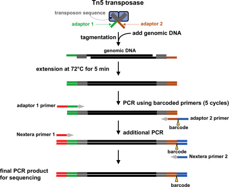
</div>

Workflow

<div align=center>
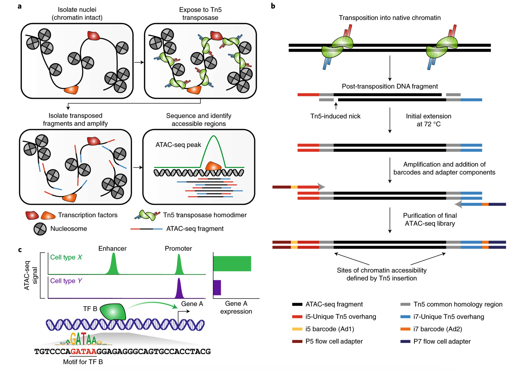
</div>

Therefore, ATAC-seq can help identify promoter regions, potential enhancers or silencers, that is, the peaks in ATAC-seq, are often sites where promoters, enhancer sequences, and some trans-regulators bind.

Isn't the body of that gene a chromatin open region? Yes ~ but the chromatin opening in the body region of a gene is not stable; when transcription is performed, the body region is transcribed with each step forward, after opening, and quickly returns to its original state after transcription.

So let's summarize, what can ATAC-seq be used for in the end?

1. Identification of important transcription factors: According to the principle, the chromatin open region captured by ATAC is generally upstream and downstream of the part of the DNA sequence being transcribed, so that we can combine the enriched sequences with motif analysis to identify which transcription factors are involved in the regulation of gene expression. (particularly effective for transcription factors with poor antibody quality)

2. Generate features of transcription factor binding regions (footprinting): After a transcription factor binds to DNA, it occupies a space that prevents the transposase Tn5 enzyme from cutting in other nucleosome-free regions, which leaves a small region, called a footprint, in which reads drop abruptly from high coverage peaks. So ATAC-seq footprints can help us to see the state of transcription factors binding on the whole genome, and are mainly applied to study cellular reprogramming mechanisms, chromatin remodeling factors, domains of epigenetic modifications on diseases, T cell depletion, etc.

3、Generate the epigenome map

4、Get the corresponding accessibility regions in different tissues or under different conditions.

5、Get the nucleosome location

## Avidin 
Avidin is a protein derived from both avians and amphibians that shows considerable affinity for biotin, a co-factor that plays a role in multiple eukaryotic biological processes. Avidin and other biotin-binding proteins, including Streptavidin and NeutrAvidin protein, have the ability to bind up to four biotin molecules.

Avidin is a biotin-binding protein that is believed to function as an antibiotic in the eggs of birds, reptiles and amphibians. Chicken Avidin has a mass of 67,000-68,000 daltons and is formed from four 128 amino acid-subunits, each binding one molecule of biotin. 

Avidin has a very high affinity for up to four biotin molecules and is stable and functional over a wide range of pH and temperature. Avidin is amenable to extensive chemical modification with little to no effect on function, making it useful for the detection and protein purification of biotinylated molecules in a variety of conditions. Because Avidin is easily purified from chicken egg whites, it is very economical to produce (much more so than streptavidin).

## Avidin-biotin interaction
Avidin and other biotin-binding proteins, including Streptavidin and NeutrAvidin protein, have the ability to bind up to four biotin molecules. The Avidin-biotin complex is the strongest known non-covalent interaction (Kd = 10-15M) between a protein and ligand. The bond formation between biotin and Avidin is very rapid, and once formed, is unaffected by extremes of pH, temperature, organic solvents and other denaturing agents. These features of biotin and Avidin – features that are shared by Streptavidin and NeutrAvidin Protein – are useful for purifying or detecting proteins conjugated to either component of the interaction.

## Biotin

Biotin is a vitamin (Vitamin H, Vitamin B7, Coenzyme R) that is present in small amounts in all living cells and is critical for a number of biological processes including cell growth and the citric acid cycle. The valeric acid side chain of the biotin molecule can be derivatized in order to incorporate various reactive groups that facilitate the addition of a biotin tag to other molecules.  Because biotin is relatively small (244.3 Daltons), it can be conjugated to many proteins and other molecules without significantly altering their biological activity. The highly specific interaction of biotin-binding proteins with biotin makes it a useful tool in assay systems designed to detect and target biological analytes.

## Blunt ends

In blunt ends, both strands are of equal length – i.e. they end at the same base position, leaving no unpaired bases on either strand. 

## Blunt end ligation

Usually, a straight cut creates blunt ends or non-overhanging ends. These ends can be joined using a DNA ligase enzyme. The joining of two blunt ends is called blunt end ligation. This does not need matching or complementary ends for ligation.

## Breakend symbol in BND translocation - square brackets

These 3 elements are combined in 4 possible ways to create the ALT. In each of the 4 cases, the assertion is that s
is replaced with t, and then some piece starting at position p is joined to t. The cases are:
REF ALT Meaning

s t[p[ piece extending to the right of p is joined after t

s t]p] reverse complementary sequence piece extending left of p is joined after t

s ]p]t piece extending to the left of p is joined before t

s [p[t reverse complementary sequence piece extending right of p is joined before t

So what does "piece extending left of p" mean? It is very hard to understand without figures.

There are two key points to understand:

One is that the breakpoints are connected. You have to make sure the connected reads are from 5 to 3 end, so it can be translated properly. In this way, sometimes the positive strand might be connected to the minus strand of another chromosome to make sure that the result sequence is from 5 to 3 end. The other point is that when we describe this connection in the VCF file, we represent the case of a connection on a positive chain (and what is the status of the other strand). In fact, in biological phenomena, both chains are connected.

<div align=center>
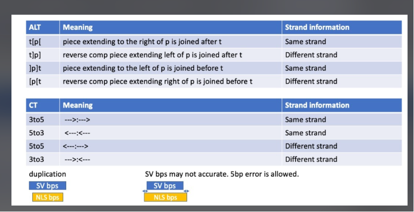
</div>

<div align=center>
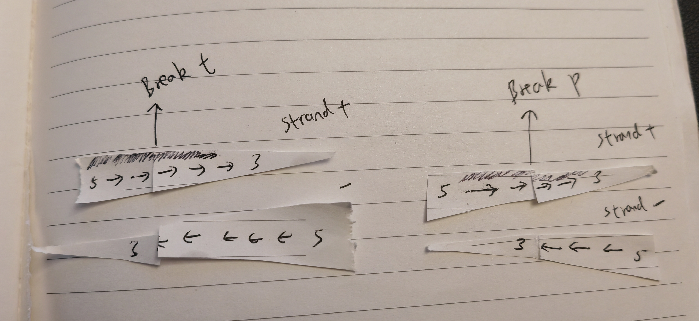
</div>

<div align=center>
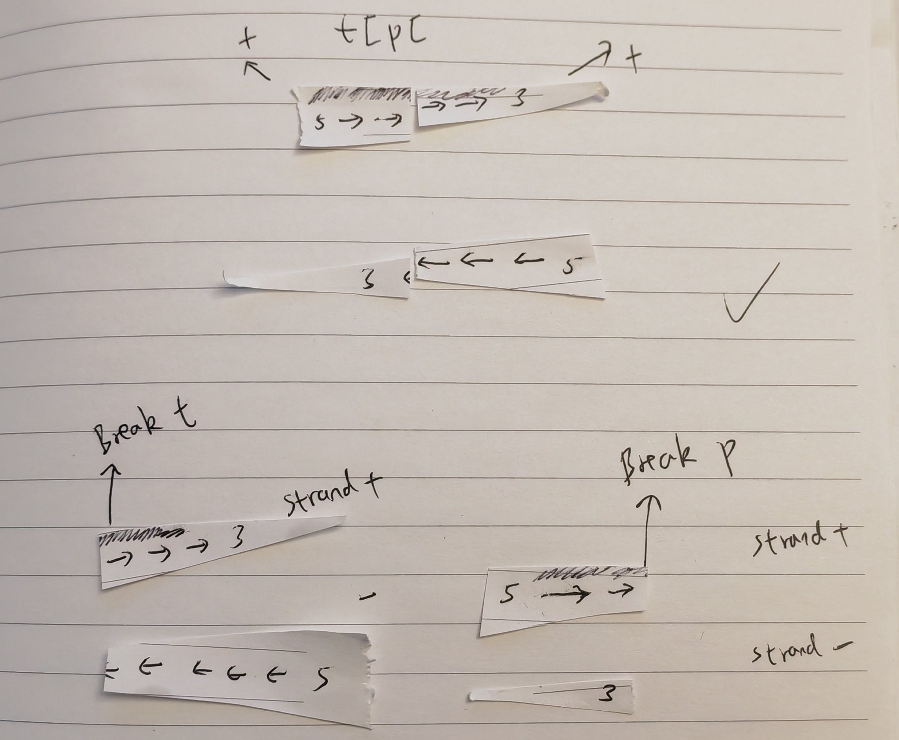
</div>

<div align=center>
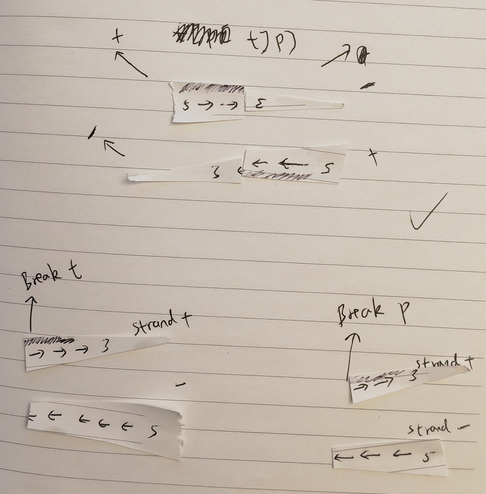
</div>

<div align=center>
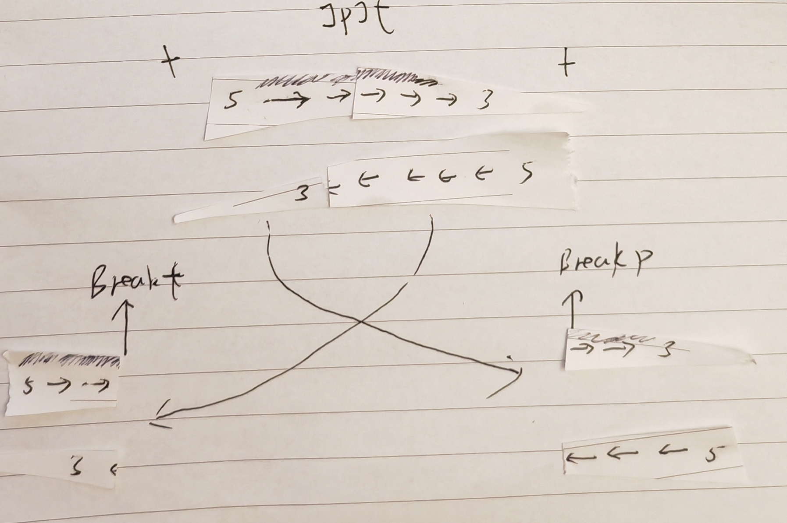
</div>

<div align=center>
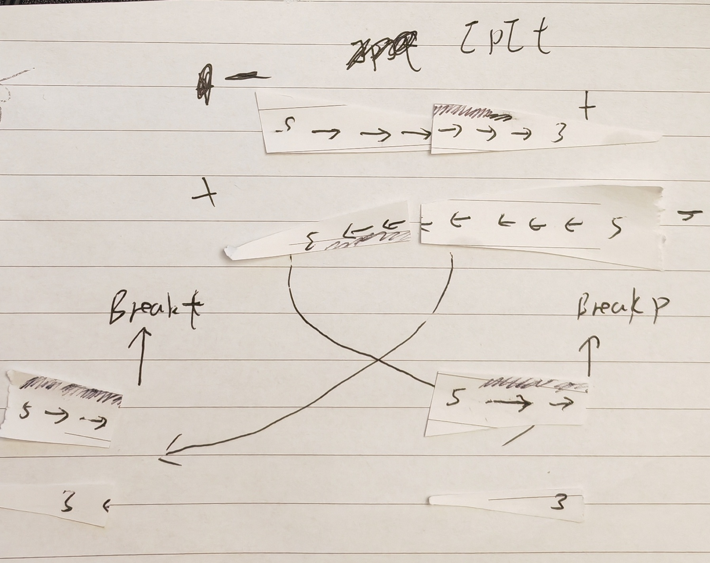
</div>


## Cancer immune Evasion through loss of MHC Class I antigen presentation

Major histocompatibility class I (MHC I) molecules bind peptides derived from a cell's expressed genes and then transport and display this antigenic information on the cell surface. This allows CD8 T cells to identify pathological cells that are synthesizing abnormal proteins, such as cancers that are expressing mutated proteins. In order for many cancers to arise and progress, they need to evolve mechanisms to avoid elimination by CD8 T cells. MHC I molecules are not essential for cell survival and therefore one mechanism by which cancers can evade immune control is by losing MHC I antigen presentation machinery (APM). Not only will this impair the ability of natural immune responses to control cancers, but also frustrate immunotherapies that work by re-invigorating anti-tumor CD8 T cells, such as checkpoint blockade. 

## Castration-resistant prostate cancer (CRPC) 

A form of advanced prostate cancer. With CRPC, the cancer no longer completely responds to treatments that lower testosterone. It shows signs of growth, like a rising PSA (prostate-specific antigen), even with low levels of testosterone.

## cDNA second strand synthesis vs SMART-seq2

Normal cDNA second strand sythesis is not a PCR process. But Takara smart-seq2 containing PCR of cDNA. The first strand cDNA synthesis is typically carried out using reverse transcription (RT) enzymes, which use a reverse transcriptase to synthesize cDNA from an RNA template. The resulting single-stranded cDNA is then converted to double-stranded cDNA through a second strand synthesis step that typically uses DNA polymerase and RNase H to remove the RNA template.

Smart-seq2 is a modified RNA-Seq protocol that combines template switching with PCR amplification to generate high-quality, full-length cDNA libraries from single cells. In this protocol, after the reverse transcription step, a template switching oligonucleotide (TSO) is added to the reaction mixture. This TSO has a short poly-dT sequence at its 3' end, which hybridizes to the poly-A tail of the mRNA template. The TSO also has a non-templated sequence at its 5' end that serves as a template for a second strand synthesis, which is carried out by a reverse transcriptase.

After the second strand synthesis, PCR amplification is carried out to amplify the cDNA libraries. The PCR step is designed to specifically amplify only full-length cDNAs, which helps to reduce bias and improve the quality of the final library. The amplified cDNA libraries can then be used for high-throughput sequencing.

So while the second strand synthesis in Smart-seq2 does involve PCR amplification, it is not a standard cDNA second strand synthesis process.

## Checkpoint blockade immunotherapy

Patients are treated with antibodies that block negative regulatory molecules, such as PD-1/PD-L1 or CTLA4, which normally restrain T cell responses. This kind of therapy can reinvigorate a patient's anti-tumor T cell responses, which then can cause tumors to shrink and even lead to cures in some patients

## Chimera rates in Whole Genome Amplification (WGA)  

Defined as the number of reads that are improperly connected (including abnormal fragment size and interchromosomal connection) divided by the total number of mappable reads. Here are the chimera rates for some commercial kits: 

the SigmaAldrich GenomePlex Single Cell Whole Genome Amplification Kit (DOP-PCR) 15%

the Qiagen REPLI-g Single Cell Kit (MDA) 2%

the General Electric (GE) illustra Single Cell GenomiPhi DNA Amplification Kit (MDA)  3%

the Yikon Genomics Single Cell Whole Genome Amplification Kit (MALBAC)  5%

the Rubicon Genomics PicoPLEX WGA Kit (MALBAC-like)  13%

the Bioskryb PTA  About 15% to 7.5%

## Chimeric/split/supplementary reads

They are the same thing.

Chimeric reads occur when one sequencing read aligns to two distinct portions of the genome with little or no overlap. This could be like sequence A mapped to 85156-85257 bp of genome, while part of sequence A mapped to 85273-85320 bp of genome. Then, sequence A is a chimeric read. Chimeric reads are indicative of structural variation. Chimeric reads are also called split reads.

An alignment of a read that cannot be represented as a linear alignment. A chimeric alignment is represented as a set of linear alignments that do not have large overlaps. Typically, one of the linear alignments in a chimeric alignment is considered the “representative” alignment, and the others are called “supplementary” and are distinguished by the supplementary alignment flag. All the SAM records in a chimeric alignment have the same QNAME.

Split alignments, or chimeric alignments, are alignments where part of the read maps to one place, and another part to another. For example, part of a long read may map to chr1 and part of it maps to chr4.

One record is marked as "representative", sometimes also called the "primary" record, while the other components of the split read are marked "supplementary", given the 2048 flag. The "primary" record generally has a SEQ field that represents the entirety of the original read's sequence (with CIGAR soft clipping operators saying which part of that sequence aligned), and the "supplementary alignments" will have SEQ field but sometimes just segments of the original read's sequence with CIGAR hard clipping operators indicating that it is partial.

Supplementary alignments are especially common with long reads, and it can be a signal for structural variants e.g. where two chromosomes are fused together, and parts of the read align to multiple chromosomes, or the split alignment may align to either side of a large deletion, or they may be split to align through an inversion (part of it aligns to the forward strand, part of it to the reverse strand, and again the forward strand)

There is no limitation on how many splits might occur so the split can align to 3, 4, or more different places. Each part of the split puts a new line in the SAM file, and note that all the records also have the same read name, or QNAME (first column of SAM).

<div align=center>
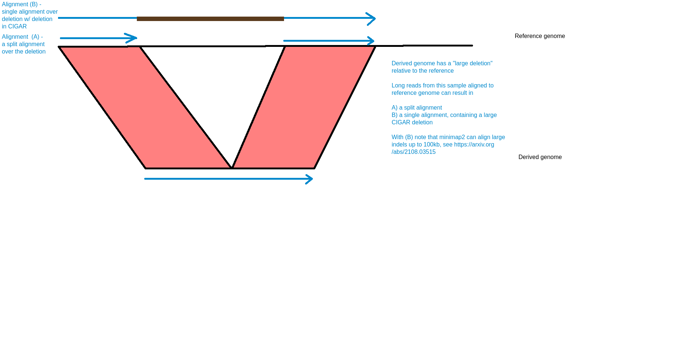
</div>

The figure is from: https://cmdcolin.github.io/posts/2022-02-06-sv-sam

## Chimeric read in PacBio

PacBio generates two types of chimeric reads:

1. unsplit subreads, i.e. siamaera
Reads structure looks like this: ----R1--->--A--<--R1.rc--. This happens quite frequently, however, it strongly depends on chemistry and particularly the quality of the libary prep. For siamaera detection, Siamaeric reads usually are separated by short joint sequences (corrupted adapter). Detection is based on blasting and identifying reads with reverse complement self hits. Reads are trimmed to the longest non-chimaeric subsequence without joint sequence.

```
----R--->--J--<--R.rc--  siamaeric read
----R--->                trimmed read

--R->-J-<----R.rc-----   siameric read2
        <----R.rc-----   trimmed read2
```

2. random fusion chimeras

I’m not exactly sure, when or how this happens, but there is a fraction of reads, where random sequences seem to be fused together. Probably some blunt end ligations during library prep, or similar effect … This seems to happen quite rarely, and it is hard to quantify exactly, as there are other effects, that can cause reads to look like chimeras, although they aren’t.

SMRT Bells are blunt end ligated to the DNA fragment being sequenced, sometimes a DNA fragment ligating to another DNA fragment before having a SMRT Bell adapter added. This would generate the classic chimera, a sequenced read being from two random parts of a genome. Note this is random and will not happen at exactly the same location more than once, so it is easily dealt with at the analysis stage. The "siamaeras" or missing adapter look like a sequence followed by the reverse complement of the sequence, and results from the SMRT Bell being missing/not-detected on one end of the insert i.e. you read a sequence forward then backwards without an adapter so the software does not know that the read needs to be split. This can happen due to sample prep - a long overhang forms a hairpin, mimicking a SMRT Bell, or less frequently due to a real SMRT bell being missed in software.

## Chromatin

Chromatin refers to the complex of DNA, RNA, and proteins that make up the chromosomes in eukaryotic cells. Chromatin is composed of nucleosomes and other proteins that interact with DNA and regulate its function. chromatin can contain RNA, although the amount and type of RNA can vary depending on the specific cell type, developmental stage, and physiological conditions.

There are different types of RNA that can associate with chromatin, including messenger RNA (mRNA), long non-coding RNA (lncRNA), small nucleolar RNA (snoRNA), and others. These RNA molecules can interact with chromatin-associated proteins, including histones and other transcriptional regulators, to modulate gene expression and chromatin structure.

It consists of genomic DNA together with all directly or indirectly associated protein and RNA molecules.

## Chromatin accessibility

Chromatin accessibility refers to the degree to which DNA is accessible to transcriptional machinery, such as RNA polymerase and other regulatory proteins. When the chromatin structure is open and accessible, transcription factors and other regulatory proteins can easily bind to specific DNA sequences and initiate gene expression. Conversely, when the chromatin structure is tightly packed and inaccessible, these proteins may not be able to access the DNA, and gene expression may be suppressed.

<div align=center>
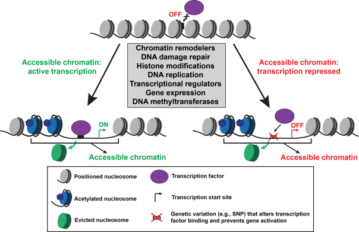
</div>

## Chromium X Series - 10x Genomics

A commom strategy for single cell RNA library prep. The figure explains better. Please see below.
<div align=center>

</div>

<div align=center>

</div>

## Chromium X Series - 10x Genomics single cell library construction

A detailed description of the whole library preparation workflow.

<div align=center>

</div>

10x Genomics technology is based on the partitioning of samples and reagents into droplets, each called a Gel
Bead in Emulsion (GEM). Once partitioned, the Gel Bead dissolves and its oligo primers are released into the
aqueous environment of the GEM. The cell captured in the GEM is also lysed. The contents of the GEM (oligos,
lysed cell components and Master Mix) are incubated in an RT reaction to generate full-length, barcoded cDNA
from the poly A-tailed mRNA transcripts. The reverse transcription reaction is primed by the barcoded Gel Bead
oligo and the reverse transcriptase incorporates the template switch oligo via a template switching reaction at
the 5’ end of the transcript. The GEMs are then “broken”, pooling single-stranded, barcoded cDNA molecules
from every cell. A bulk PCR-amplification and Enzymatic Fragmentation follow. Size selection is then used to
optimize the insert size of the double-stranded cDNA prior to library construction. During library construction
Read 2 is added by Adapter ligation. Illumina P5 and P7 sequences and sample index sequences are added
during the Sample Index PCR. The final library fragments contain the P5, P7, Read 1 and Read 2 sequences used
in Illumina bridge amplification and sequencing. Additionally, each fragment contains the 10x Barcode, UMI and
cDNA insert sequence used in data analysis.

<div align=center>

</div>

What does the final seq looks like?

<div align=center>

</div>


## Chromosome

A chromosome is a linear strand of DNA that is compacted and organized by proteins, including histones, into a highly condensed structure. Chromosomes carry genetic information in the form of genes and are passed down from parent to offspring during cell division.

## Cis and trans regulation

Let’s start by discussing the meaning of “cis” and “trans.” The term cis is derived from the Latin root “cis,” meaning “the same side as.” In contrast, the term trans comes from the Latin root “trans,” meaning “across from.” In molecular biology, a cis-acting (or cis-regulatory) element refers to a region of the chromosomal DNA that regulates the transcription or expression of a gene that is on the same chromosome. A trans-acting (or trans-regulatory) element, on the other hand, refers to a soluble protein that binds to the cis-acting element of a gene to control its expression. The gene that encodes the soluble trans-acting protein can reside on any chromosome, often located far away from the gene whose expression it regulates.

Cis-acting elements are not part of the coding sequences of the gene they regulate: they may be near the promoter or the 5’ region of the gene, and in some cases they may be many kilobases downstream of the gene. In eukaryotes, enhancers are a common type of cis-acting element. As its name implies, an enhancer promotes gene expression when the appropriate trans-acting element(s) binds to it.

Trans-acting elements, also known as transcription factors, can either promote or inhibit gene expression. A given transcription factor can work with other transcription factors to regulate the expression of a single gene or a group of related genes. Conversely, a gene may have several transcription factors bind to its cis-regulatory elements at the same time or at different times, depending on the cellular and environmental signals. As you might imagine, these different levels of gene regulation give the organism a wide range of mechanisms to control which genes are turned on or off at any given moment.

Classically, regulation of gene expression on DNA level is mediated by protein–DNA interactions (Watson et al. 2007). The regulating proteins are often called transcription factors. The regulating DNA elements are often called transcription factor–binding sites. Because transcription factors are often encoded by genes far from the regulated gene, they are also called as trans-regulatory factors. Because the regulating DNA elements are often very close to the coding region of the regulated gene, they are also called as cis-acting elements. There are thousands of genes in genomes. They are regulated properly to function. Mapping the gene regulatory network composed of trans and cis regulations is an important and challenging topic of systems biology (Wray 2007).

## Complex structural variation (SV)  
While SV is typically defined by its canonical forms – duplication, deletion, insertion, inversion and translocation – recent breakpoint mapping studies have revealed a surprising number of “complex” variants that evade simple classification. Complex SVs are defined by clustered breakpoints that arose through a single mutation but cannot be explained by one simple end-joining or recombination event.

<div align=center>

</div>

## Copy number variation (CNV)
Copy number variation (CNV) is a phenomenon in which sections of the genome are repeated and the number of repeats in the genome varies between individuals. Such regions may or may not contain a gene(s).

## CRAM (file format)
Compressed Reference-oriented Alignment Map (CRAM) is a compressed columnar file format for storing biological sequences aligned to a reference sequence. CRAM was designed to be an efficient reference-based alternative to the Sequence Alignment Map (SAM) and Binary Alignment Map (BAM) file formats.

## Differential transcript usage (DTU) analysis
A differential transcript usage (DTU) analysis is testing for proportional differences in a gene's transcript composition, and has been of rising interest for many research questions, such as analysis of differential splicing or cell-type identification.

## Discordant reads and cordant reads
1) Concordant reads (Properly aligned reads)
2) Discordant reads (improperly aligned reads: important to identify genome alteration events)

Concordant reads: have span size within the range of expected fragment size and consistent orientation of read pairs with respect to reference.

Discordant reads: have unexpected span size/inconsistent orientation of read pairs.

Example:

Concordant Reads** - R1----->Expected Mapping distance and orientation<-----R2

Discordant reads: Discordant reads have different categories

A) Based on mapping Distance

R1-----> Unexpected mapping distance <-----R2
B) Based on read orientation (Expected read orientation for Paired-end data should be R1 (Forward) R2 (Reverse): FR orientation, but in case of discordant reads, orientations are either FF or RR)

R1-----> R2-----> [FF orientation]

R1<----- R2<---- [RR orientation]

## DNA dA-Tailing
This is a next step of DNA end-repair. Adding a non-template dAMP (dA) to the 3’ end of a blunt-ended DNA fragment. This incorporated 3’-dA prevents concatemer formation and prepares the DNA fragment for subsequent ligation of adaptors or cloning vectors that have complementary 3’-dT overhangs. 

In other words, add "A" base to the 3´ end of a blunt phosphorylated DNA fragment. This treatment creates compatible overhangs for the next step of DNA sample preparation.T

## Enhancer
An enhancer is a short (50–1500 bp) region of DNA that can be bound by proteins (activators) to increase the likelihood that transcription of a particular gene will occur. They can be located up to 1 Mbp (1,000,000 bp) away from the gene, upstream or downstream from the start site. Enhancers are found mostly in the intergenic and intronic regions, while a few enhancers have been found within exons.

<div align=center>

</div>

<div align=center>

</div>

Here is an enhancer diagram. Within this DNA sequence, protein(s) known as transcription factor(s) bind to the enhancer and increases the activity of the promoter. 1. DNA 2. Enhancer 3. Promoter 4. Gene 5. Transcription Activator Protein 6. Mediator Protein 7. RNA Polymerase

## Epigenome

An epigenome consists of a record of the chemical changes to the DNA and histone proteins of an organism; these changes can be passed down to an organism's offspring via transgenerational stranded epigenetic inheritance. Changes to the epigenome can result in changes to the structure of chromatin and changes to the function of the genome.

The epigenome refers to a collection of chemical modifications that occur on the DNA molecule and its associated proteins, which can alter gene expression without changing the underlying DNA sequence. These modifications include the addition or removal of small chemical tags, such as methyl groups, to the DNA molecule or its associated histone proteins, as well as the presence of non-coding RNA molecules. These modifications can influence the way that the DNA is packaged and accessed within the cell, allowing genes to be turned on or off in response to environmental and developmental cues.

The epigenome can be inherited from one generation to the next. In some cases, the modifications to the epigenome that occur during an individual's lifetime can be passed on to their offspring through a process called epigenetic inheritance. This occurs when the modifications to the epigenome are present in the sperm or egg cells that will form the embryo.

ATAC-seq and ChIP-seq are two methods used to study the epigenome.

## Epitope

It is capable of stimulating an immune response. This is usually one to six monosaccharides or five to eight amino acid residues on the surface of the antigen. Each antigen typically has many epitopes. 

## Exitron

Exitrons are exon-like introns located within protein-coding exons. Removal or retention of exitrons through alternative splicing increases proteome complexity and thus adds to phenotypic diversity.Exitrons are defined as introns within protein-coding exons that, when retained, maintain the protein-coding potential of the transcript. Marquez and colleagues argue that four features distinguish exitrons from other introns: high GC content, absence of stop codons, overrepresentation of a size corresponding to multiples of three nucleotides, and prevalence of synonymous substitutions (as usually observed for exonic sequences).

Transcripts with exitrons in their sequences can be distinguished from those with retained introns in three ways. First, transcripts containing exitrons are transported out of the nucleus to be translated, whereas those containing introns are identified as incompletely processed and are kept in the nucleus where they cannot be translated. Second, only transcripts with exitrons of lengths not divisible by three have the potential to incorporate premature termination sequences, while sequences with introns normally result in premature termination. Third, exitron transcripts are usually the major isoform, but those with introns are only present in small amounts.

## Extrachromosomal circular DNA （ecDNAs）
Extrachromosomal circular DNA (eccDNA) is a type of double-stranded circular DNA structure that is derived and free from chromosomes. It has a strong heterogeneity in sequence, length, and origin and has been identified in both normal and cancer cells. In contrast to previously identified circular DNA structures (e.g., bacterial plasmids, mitochondrial DNA, circular bacterial chromosomes, or chloroplast DNA), eccDNA are circular DNA found in the eukaryotic nuclei of plant and animal (including human) cells. Extrachromosomal circular DNA is derived from chromosomal DNA, can range in size from 50 base pairs to several mega-base pairs in length, and can encode regulatory elements and full-length genes. EcDNA, as the vehicles for oncogene and drug-resistance genes, enables them to be rapidly amplified, and lead to overexpression consequently.For instance, oncogenes EGFR and c-MYC were found in ecDNA and amplified in human cancer tissues than normal tissues. Lacking a high-order chromatin structure, suppressing histone modifications, and insulator shackle make ecDNAs more accessible than their genome counterparts which may facilitate promoter–enhancer interactions, transcription initialization, and achieving additional expression.

## F1-score
The F1-score combines the precision and recall of a classifier into a single metric by taking their harmonic mean. It is primarily used to compare the performance of two classifiers. Suppose that classifier A has a higher recall, and classifier B has higher precision. In this case, the F1-scores for both the classifiers can be used to determine which one produces better results.

## Flongle adaptor and flow cell
Flongle is an adapter for MinION or GridION that enables direct, real-time DNA or RNA sequencing on smaller, single-use flow cells. It delivers up to 1.8 Gb of data. Providing immediate access to sequence data, Flongle is designed to be the quickest, most accessible and cost-efficient sequencing system for smaller or more frequently performed tests and experiments. Flongle flow cells should be used within 4 weeks of receipt.

## Gene fusions
A fusion gene is a hybrid gene formed from two previously independent genes. It can occur as a result of translocation, interstitial deletion, or chromosomal inversion. Fusion genes have been found to be prevalent in all main types of human neoplasia. The identification of these fusion genes play a prominent role in being a diagnostic and prognostic marker.

<div align=center>

</div>

<div align=center>

</div>

## Gene fusion - Anchor length

The length of the left and right ends of the read spanning the fusion site, as shown in the right panel in Figure B above.

## Gene fusion - Breakpoint  

The location on the genome where the fusion of two fused genes occurs, such as the site where Gene A (blue) and Gene B (green) are fused in Figure B above.

## Gene fusion - Broken exon (BE) type fusion  

Which refers to the fusion without retaining the original intact exon sequence. For example, in the above figure A, part of the sequence of Exon3 of Gene A is fused with Exon2 of Gene B. In the new gene after fusion, part of the sequence of Exon3 from Gene A is lost.

## Gene fusion - Circular RNAs (false-positive)

Circular RNAs are transcripts which are spliced in a non-canonical mannor such that the 5' and 3' ends are ligated together, yielding a closed ring. In RNA-Seq data they manifest as intragenic duplications with both breakpoints at splice-sites. It is very hard to distinguish genomic duplications from circular RNAs without whole-genome sequencing data. Similar to read-through fusions, these transcripts are abundant in healthy tissue and affect many genes. Arriba's blacklist effectively filters the majority of such events, but occasionally some pass the filter. For this reason, they are tagged as duplication/non-canonical_splicing to warn the user about a potential false positive.

## Gene fusion - Intact exon (IE) type fusion  

The original exon is retained intact after the fusion, and the original exon structure is not affected. For example, in the above figure A, Exon2 of Gene A and Exon1 of Gene B are fused and the sequences of the two exons are retained intact.

## Gene fusion - Long insert size

The longer distance between two reads in double-end sequencing mate-pair sequencing, generally several kilobases or even longer.

## Gene fusion - Read-through fusions (false-positive)

Even in healthy tissue it happens very frequently that transcripts are produced which are composed of exons from two neighboring genes on the same strand. These transcripts often contain all but the last exon of the 5' gene and all but the first exon of the 3' gene. They are caused by RNA polymerases missing the stop sign at the end of the 5' gene and "reading through" until reaching the next stop sign at the end of the 3' gene. The splicesome then removes the intergenic region between the two genes, yielding a chimeric transcript.

For some genes, this is a common phenomenon, which is not reflected in the gene annotation, however, and therefore appears like an aberrant transcript at first glance. The SLC45A3:ELK4 fusion, which has been discovered in prostate cancer and has also been described in benign prostate tissue, is one such example. It is risky to discard all read-through events, however, because they might be the result of a focal deletion, which fuses two neighboring genes together. For example, the GOPC:ROS1 fusion in glioblastoma multiforme is caused by a 240 kb deletion. Arriba uses a comprehensive blacklist trained on collections of RNA-Seq samples from healthy tissue to remove likely harmless transcript variants. Rare transcript variants still bypass this filter often enough. Read-through events are therefore tagged as deletion/read-through to make the user aware of a potential false positive. Further evidence should be sought to substantiate the prediction, such as:

(1) high expression of the transcript; (2) a deletion detected in DNA-Seq data as a structural variant or copy-number alteration; (3) multiple deletion/read-through events affecting the same region (it is unlikely that many events pass the blacklist).

<div align=center>

</div>

## Gene fusion - Short insert size

The shorter distance between two reads in double-end sequencing paired-end sequencing, generally a few hundred bp.

## Gene fusion - Spanning read

a paired-end read that matches across the fusion site to two fusion genes, respectively, such as the pair of reads matching to Gene A (blue) and Gene B (green) in Figure B above.

## Gene fusion - Split read

A read that matches exactly to the fusion site, as shown in the right panel in Figure B above.

## Genotype phasing

Phasing is the process of inferring haplotypes from genotype data. This information is often important for understanding gene expression patterns for genetic disease research. The popular NGS sequencing technology is to mix the sequences together, and after sequencing, we cannot directly distinguish which of these sequences is the parental source and which is the maternal source. We usually only detect which variants are present in the genome and the base composition of these variants (pure and heterozygous), which is usually referred to as genotype. This distinction can only be achieved with Phasing.

<div align=center>

</div>

<div align=center>

</div>

## Germline INDEL
INDEL that is identified in germline (i.e., blood‐extracted) DNA samples. For germline indels from healthy genomes, they are mainly genetic variants with the type and position of the indels presumably conserved in sub-populations or super populations. In other words, they are less random compared with somatic variants and usually do not lead to diseases.

## Germline mutation 
A genetic change in a germ cell (egg or sperm) that becomes the DNA of each cell in the offspring's body. A variant (or mutation) contained in the germline can be passed from parent to offspring and is therefore inherited. They are also called germline mutations. INDELs are identified by removing the germline mutations from INDELs.

## GridION Mk1
The GridION Mk1 provides users with five sequencing ports where MinION flow cells or Flongle adapters with flow cells can be connected, as well as a high performance integrated computer and basecalling accelerator. The device can basecall, in real-time, the data generated by five flow cells/Flongles. The current chemistry and software enables generation of up to 150 Gbases of data during a GridION Mk1 run. Up to 250 Gb (all 5 flow cells sequencing).

## Histone proteins

Histone proteins are a family of small, positively charged proteins that are rich in arginine and lysine residues. They are the major protein component of nucleosomes and are involved in the packaging of DNA into chromatin. There are five main types of histones: H1, H2A, H2B, H3, and H4.

<div align=center>
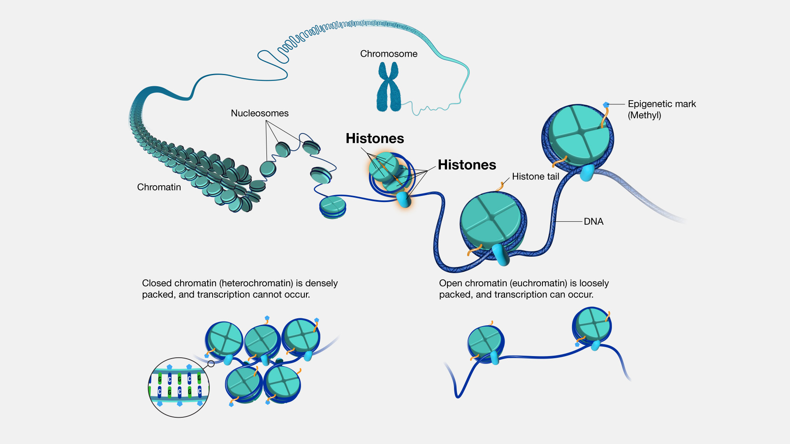
</div>

## Homopolymer

Homopolymer, e.g. A-A-A-A-A-A-A-A-A-A-A, simple repetition

## Human genome assembly - b37

The Broad Institute created a human genome reference file based on GRCh37. When people at The Broad Institute's Genomics Platform refer to the hg19 reference, they are actually referring to b37.

## Human genome assembly - GRCh37

GRCh37 is the Genome Reference Consortium Human genome build 37. As of May 7, 2014 it has been replaced with GRCh38 as the standard reference assembly sequence used by NCBI. Unlike other sequences, GRCh37 is not from one individual's genome sequence, but is built from reference sequences of different individuals. In essence: GRCh37 is identical to hg19 on the main contigs (chr1-24), but differ on chrM.

## Human genome assembly - GRCh38

GRCh38 is an improved representation of the human genome compared to GRCh37, where many gaps were closed, sequencing errors corrected and centromere sequences modelled. For the state-of-the-art of the human genome and its annotation, go to GRCh38.

## Human genome assembly - hg19

There are a few minor differences between GRCh37 and hg19. The contig sequences are the same but the names are different, i.e. "1" may need to be converted to "chr1". In addition UCSC hg19 is currenly using the old mitochondrial sequence but NCBI and Ensembl have transitioned to NC_012920.

## Human genome assembly - hg38
The same with GRCh38.

## Human genome assembly - hs37d5

hs37d5 (known also as b37 + decoy) was released by The 1000 Genomes Project (Phase II), which introduced additional sequence (BAC/fosmid clones, HuRef contigs, Epstein-Barr Virus genome) to the b37 reference to help reduce false positives for mapping. Note that this one uses the primary assembly of GRCh37.

## Illumina adapter portfolio

The first step of sequencing is to construct a library from DNA or RNA. A library contains DNA inserts flanked on each side by an adapter, as shown below:

<div align=center>

</div>

Schematic representation of a dual-indexed library fragment

Adapters contain:

Sequences that allow the library to bind and generate clusters on the flow cell (p5 and p7 sequences)  

Sequencing primer binding sites to initiate sequencing (Rd1 SP and Rd2 SP)  

Index sequences (Index 1 and, where applicable, Index 2), which are sample identifiers that allow multiplexing/pooling of multiple samples in a single sequencing run or flow cell lane.  

## Intergenic region
An intergenic region is a stretch of DNA sequences located between genes. Intergenic regions may contain functional elements and junk DNA. Intergenic regions should not be confused with intragenic regions (or introns), which are short, non-coding regions that are found within genes, especially within the genes of eukaryotic organisms.Intergenic regions contain a number of functional DNA sequences such as promoters and regulatory elements, enhancers, spacers, and (in eukaryotes) centromeres. They may also contain origins of replication, scaffold attachment regions, and transposons and viruses.[2] Non-functional DNA elements such as pseudogenes and repetitive DNA, both of which are types of junk DNA, can also be found in intergenic regions—although they may also be located within genes in introns.

<div align=center>

</div>

## Intron retention 

An overview of the intron retention (IR) mechanism: different isoforms can be produced from a single gene through AS. (A), Isoforms with introns fully spliced are sent out of the nucleus for translation. Intron-retaining isoforms (IRIs) can be generated through IR (no intron retention): (B), In most cases, the IRIs are degraded by the nonsense-mediated decay (NMD) pathway, the reason being that retained introns often contain premature termination codons (PTCs) that can trigger NMD (with intron retention): (C), In some cases, the IRIs are detained in the nucleus, and in response to stimuli these IRIs can undergo further splicing to remove the retained intron, before being exported out of nucleus for translation (with intron retention): (D), In the case of cytoplasmic splicing, IRIs are shuttled to the cytoplasm for preservation and may be subject to further splicing (with intron retention): (E), In yet another case, IRIs escape from the NMD pathway and are translated into protein isoforms, which, compared with normal protein isoforms, are often truncated and may lose domains; however, it could also be that the alternative protein isoforms include extra domains formed by the amino acid sequences translated from retained introns (with intron retention).  

<div align=center>

</div>

## Lambda control DNA  

Lambda DNA is 48 kb long and serves as a good model system to evaluate the sequencing workflow. The DNA molecule of 48502 basepairs is linear and except for the extreme ends double-stranded. At each end the 5' strand overhangs the 3' strand by 12 bases. The sequences of the ends are complementary.

## Lentivirus transfection

Three plasmid systems, PAX2, VSVG and shuttle plasmids (containing shRNA genes, or siRNA genes, or cDNA, or the CDS region of the target gene)

Using shRNA as an example, the shuttle plasmid contains the DNA encoding the shRNA. shRNA formed by two structural proteins + shRNA genes at the time of viral packaging (this part acts as the lentiviral genome because lentiviruses are RNA viruses). The shRNA formed is packaged with the structural proteins to form the virus because of the packaging signal. The virus then enters the target cell and the shRNA is reverse transcribed into DNA, which is integrated into the host genome, and then transcribed into shRNA for expression, and the expressed shRNA produces siRNA, which represses the corresponding gene.

As an example of common gene overexpression, the target gene DNA is added to the shuttle plasmid. The virus is packaged with two structural proteins + the RNA formed from the transcription of the target gene (this part acts as the lentiviral genome because lentiviruses are RNA viruses). The target gene RNA formed is packaged into the virus along with the structural proteins because of the packaging signal. Then the virus enters the target cell, the target gene RNA is reverse transcribed into DNA, integrated into the host genome, and then transcribed into RNA for expression, and the expressed protein becomes more and becomes overexpressed.

As for the target gene of overexpression, it is the CDS region: design upstream and downstream specific amplification primers, while introducing enzyme cut sites, PCR (using high fidelity KOD enzyme with 0% mutation rate within 3K) to retrieve the target gene CDS region (coding sequence) from the template (CDNA plasmid or library) connected into the T vector. The CDS region is excised from the T vector and loaded into a lentiviral overexpression plasmid vector.

The target gene is transcribed into RNA in 293T cells. this RNA can be recognized and packaged into viral particles because the other two plasmids, required for viral packaging, encode the viral structural proteins and the proteins required for packaging signals. When these proteins are expressed in 293T cells, they are able to recognize specific sequences in the RNA of the target gene (called psi sequences, or packaging signals) and thus package the target gene RNA into the viral particle.

In this way, in 293T cells, we have viral structural proteins, reverse transcriptase and target gene RNA, which together make up the lentiviral particles. The viral particles can infect the target cells, where the target gene RNA is reverse transcribed into DNA and integrated into the target cell genome. The target gene is then expressed in the target cell. Depending on the different functions of the target gene, overexpression or repression of a specific gene can be achieved. For example, if the target gene is a shRNA, then the shRNA expressed in the target cell will produce siRNA, which enables RNA interference and suppresses the expression of the corresponding gene. If the target gene is a protein-coding gene, then it will be transcribed and translated in the target cell, thereby producing protein and achieving overexpression.

In summary, during lentiviral packaging, the target gene is transcribed into RNA in packaging cells (e.g. 293T cells), which together with viral structural proteins and reverse transcriptase form lentiviral particles. These particles can infect the target cells and integrate the target gene into the host cell genome to achieve its function.

In 293T cells, it is indeed possible for the RNA of the target gene to be translated into a protein. However, the formation and packaging of viral particles is usually a highly prioritized process during viral packaging. In addition, the expression of other viral components in virus packaging cells, such as structural proteins and reverse transcriptase, may take up more translation resources. Therefore, in practice, the expression of target genes in 293T cells is relatively low and has a limited impact on the viral packaging process. Of course, this does not mean that the target gene will not be expressed at all in 293T cells, but this expression is usually not sufficient to have a significant impact on the viral packaging process.

<div align=center>
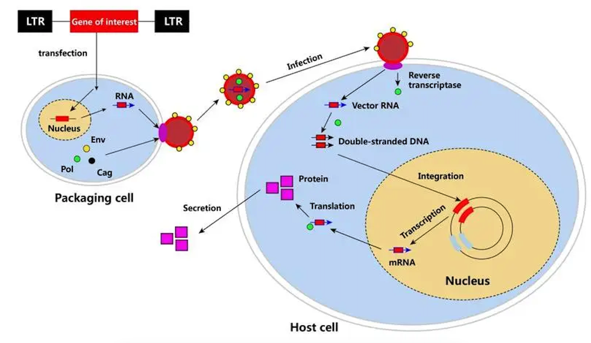
</div>

## Linear Amplification via Transposon Insertion (LIANTI)  

A linear whole genome amplification (WGA) method.LIANTI achieved linear amplification of the whole genome for the first time, enabling more uniform and accurate amplification.  

Genomic DNA is randomly fragmented and tagged by Tn5 transposon insertion containing T7 promoter sequence, and the resulting DNA fragments are linearly amplified into RNAs by T7 in vitro transcription. Following reverse transcription and second strand synthesis, double-stranded DNA amplicons are formed representing the linear amplification product of the original genomic DNA, which is suitable for DNA library preparation and sequencing.

<div align=center>

</div>

<b>Experimental workflow</b>  

1. Cell lysis. Single cells are placed into PCR tubes containing lysis buffer by mouth pipetting, flow sorting, micromanipulator, laser dissection or microfluidic devices. Cells are subsequently lysed by Qiagen protease digestion. If the starting material is small amount of genomic DNA instead of single cells, cell lysis step can be skipped.

2. LIANTI transposome. LIANTI transposome is made by mixing equal molar of Tn5 transposase and LIANTI transposon DNA. The sequence of LIANTI transposon DNA is: 5'/Phos/CTGTCTCTTATACACATCTGAACAGAATTTAATACGACTCACTATAGGGAGATGTGTATAAGAGACAG-3' After self annealing, the LIANTI transposon DNA consists of a 19-bp double-stranded region for Tn5 transposase binding and dimerization, and a 30-nt single-stranded loop containing T7 promoter sequence.

3. Tn5 transposition. Genomic DNA from a single cell is randomly fragmented and tagged by LIANTI transposome insertion during transposition reaction.

4. Gap filling. After Tn5 transposition, both ends of each DNA fragment are gap filled and extended by DNA polymerase extension, converting single-stranded loops into double-stranded T7 promoters on both ends of each fragment. The residue Tn5 transposase and DNA polymerase are subsequently removed by protease digestion, followed by heat inactivation of the protease.

5. In vitro transcription (IVT) linear amplification. Still within the same PCR tube, overnight IVT reaction is assembled, including standard IVT buffer, NTPs, T7 RNA polymerase, RNase inhibitor, DMSO, etc.

6. Reverse transcription (RT). After overnight IVT, RNAs representing the linearly amplified products of the original genomic DNA are column purified, self primed on the 3′ end, and reverse transcribed. RNase digestion is carried out to convert the double-stranded DNA-RNA hybrids into single-stranded DNA.

7. Second strand synthesis (SSS). Taking advantage of the 19-bp specific sequence on the 3' end of each single-stranded DNA, SSS step is performed by specific priming and DNA polymerase extension. The resulting double-stranded DNA fragments are LIANTI amplicons linearly amplified from the original single-cell genomic DNA, with unique molecular barcodes attached on each amplicon.

8. Library prep and sequencing. Depending on transposome insertion density and specific applications, LIANTI amplicons can be subject to optional sonication, before proceeding to standard library prep pipelines (i.e. NEBNext Ultra II DNA Library Prep Kit for Illumina).

<b>Very important: sometimes it is hard to understand this process, just remeber two tips: (1) a Tn5 transposase will always recognize and combine the Tn5 transposon end sequence; (2) when a Tn5 transposase dimers (two Tnp together) each contains a sequence (whether it is adaptor P5, P7 or it is T7 protor), it looks like that the Tn5 transposase will insert two sequences at the 5 end and 3 end of the target DNA respectively. Infact that is not the truth. One Tnp will only insert the seq it carries into the DNA, this is because three kinds of sequences will be produced during the process </b>

<div align=center>

</div>

<b>Adavantages</b>  
1. Accurate detection of single-cell copy-number variations (CNVs) with kilobase resolution  
2. Accurate detection of single-cell single-nucleotide variations (SNVs)  

## LNCaP cells
LNCaP cells are a cell line of human cells commonly used in the field of oncology. LNCaP cells are androgen-sensitive human prostate adenocarcinoma cells derived from the left supraclavicular lymph node metastasis from a 50-year-old caucasian male in 1977. They are adherent epithelial cells growing in aggregates and as single cells.

## (MALBAC) Multiple Annealing and Looping Based Amplification Cycles

A quasilinear whole genome amplification method. Unlike conventional DNA amplification methods that are non-linear or exponential (in each cycle, DNA copied can serve as template for subsequent cycles), MALBAC utilizes special primers that allow amplicons to have complementary ends and therefore to loop, preventing DNA from being copied exponentially. This results in amplification of only the original genomic DNA and therefore reduces amplification bias.The key to MALBAC is to not make copies of copies, and instead make copies only of the original genomic DNA by protecting the amplification products. MALBAC uses a thermally stable DNA polymerase with strand displacement activity. This important preamplification stage is then followed by exponential amplification of the full amplicons by PCR, generating the amount of DNA required for next-generation sequencing. MALBAC’s sequence-dependent bias is reproducible along the genome from cell to cell. Therefore, signal normalization for CNV noise reduction can be carried out. As shown below, after signal normalization with a reference cell, MALBAC offers the best CNV accuracy.

<div align=center>

</div>

## MAS-seq from Pacbio

The MAS-Seq for 10x Single Cell 3’ kit takes as input single-cell cDNA and outputs a sequencing-ready library that results in a 16-fold throughput increase compared to regular single-cell Iso-Seq® libraries.

However, MAS-Seq cannot detect RNA modifications.

Regular 10x single-cell RNA sequencing does not directly detect RNA modifications. The standard protocol for 10x single-cell RNA sequencing uses oligo-dT primers to capture the poly-A tails of mRNA molecules, which are then reverse transcribed to generate cDNA libraries for sequencing. During this process, RNA modifications are not specifically labeled or detected, and therefore are not directly captured in the resulting sequencing data.

Steps include: (1) PCR with biotin-primer and TSO primer, to label full length cDNA; (2) Beads pull down to remove TSO artifact; (3) another PCR to amplify; (4) Add adaptor.

<div align=center>

</div>

## MDA - inverted chimera

The displaced 3'-terminus would be free to reanneal, preferentially at randomly occurring complementary segments on nearby 5'-strands. The outcome will be the joining of two sequences in inverted orientation. The finding that 85% of chimeras had this inverted form supports this as the likely mechanism. The chimeric junctions also reveal the site where the displaced 3'-end annealed to the second template and continued elongation. In the example , from one of the sequenced chimeric junctions, priming was initiated on the new template where the sequence on the 3'-end had annealed to the sequence on the 5'-strand. In 76.8% of cases, the 3'-ends initiated priming at complimentary sequences of ≥ 2 bp on the new templates. These ranged up to 21 base pairs of complimentarity (Fig 4). The complimentarity occurred in 93.5% and 90.9% of cases for inverted and directly joined segments, respectively, when <10 kb apart, but only 34.8% and 27.6%, respectively, when >10 kb apart.

Inverted chimera is characterized by the fact that the original sequence (A), after a small sequence (green, usually 3-31bp), the new sequence is an inverted sequence (B) at another position. This inverted sequence is compared to the negative strand of the genome. The sequence that corresponds to the positive strand is the reverse complementary sequence of B, and a small segment of sequence downstream of this new reverse complementary sequence in plus strand (towards the 3 end of the genome) should be reverse complementary to a segment of the original sequence (A). The segment is taken at breakingpoint forward (toward the 5 end of the genome).

<div align=center>

</div>

<div align=center>

</div>

## Melanoma

Melanoma, the most serious type of skin cancer, develops in the cells (melanocytes) that produce melanin — the pigment that gives your skin its color.

## MHC class I

MHC class I molecules are expressed in all nucleated cells and also in platelets—in essence all cells but red blood cells. It presents epitopes to killer T cells, also called cytotoxic T lymphocytes (CTLs). A CTL expresses CD8 receptors, in addition to T-cell receptors (TCR)s. When a CTL's CD8 receptor docks to a MHC class I molecule, if the CTL's TCR fits the epitope within the MHC class I molecule, the CTL triggers the cell to undergo programmed cell death by apoptosis. Thus, MHC class I helps mediate cellular immunity, a primary means to address intracellular pathogens, such as viruses and some bacteria, including bacterial L forms, bacterial genus Mycoplasma, and bacterial genus Rickettsia. In humans, MHC class I comprises HLA-A, HLA-B, and HLA-C molecules.

## Microhomology in structural variations

Besides the micro-insertions, short stretches (usually 2–6 nucleotides) of identical sequence, known as overlapping microhomology31, were frequently spotted at SV breakpoint junctions.

<div align=center>
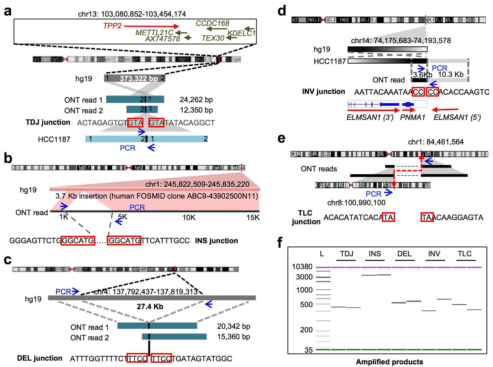
</div>

## Micro-insertion in structural variantions

Micro-insertions refer to the addition of small segments of DNA (usually less than 500 bp in length) at the breakpoints of structural variations (SVs) in the genome. These inserted sequences are often non-aligned, meaning that they do not match up with the reference genome, and are frequently novel with no homology to known sequences. Micro-insertions are thought to be the result of non-templated DNA synthesis at the rearrangement junctions during the repair of DNA double-strand breaks through the non-homologous end-joining (NHEJ) mechanism.

## MinION

Similar to MinION Mk1C, but come without screen. Starter Packs from $1,000 including 1 flow cell andd 1 kit. The enhanced has 4 flow cells and 1 kit with $3,250.

## MinION Mk1C

Nanopores read the length of DNA or RNA presented to them — from short to ultra-long (longest >4 Mb). Up to 50 Gb per MinION Flow Cell / 2.8 Gb per Flongle Flow Cell. Theoretical max output when system is run for 72 hours (or 16 hours for Flongle) at 420 bases / second. Outputs may vary according to library type, run conditions, etc. Starter Packs from $4,900, including consumables Compatible with Flongle Flow Cells for smaller tests and analyses. The starter pack includes six flow cells and 1 library kit. It is for filed-use and come with a screen.

## Multiple displacement amplification (MDA)  

MDA offers much higher genome coverage than DOP-PCR. However, like DOP-PCR, MDA is an exponential amplification process. This results in sequence-dependent bias, causing overamplification in certain genomic regions and underamplification in other regions. However, such uneven bias of MDA is not reproducible along the genome from cell to cell, causing CNV measurements noisy and normalization ineffective. Nevertheless, MDA has been widely applied since its invention. <b> It is PCR-free, and under isothermal conditions, The DNA fragments are 50–100 kb long. </b>

## Multiplex sequencing 

Allows large numbers of libraries to be pooled and sequenced simultaneously during a single run on Illumina instruments. Sample multiplexing is useful when targeting specific genomic regions or working with smaller genomes. Pooling samples exponentially increases the number of samples analyzed in a single run, without drastically increasing cost or time.

With multiplex sequencing, individual "barcode" sequences are added to each DNA fragment during next-generation sequencing (NGS) library preparation so that each read can be identified and sorted before the final data analysis. These barcodes, or index adapters, can follow one of two major indexing strategies depending on your library prep kit and application.

## Nanopore sequencing
Using nanopore sequencing, a single molecule of DNA or RNA can be sequenced without the need for PCR amplification or chemical labeling of the sample. A MinION flow cell contains 512 channels with 4 nanopores in each channel, for a total of 2,048 nanopores used to sequence DNA or RNA. The wells are inserted into an electrically resistant polymer membrane supported by an array of microscaffolds connected to a sensor chip. Each channel associates with a separate electrode in the sensor chip and is controlled and measured individually by the application-specific integration circuit (ASIC). Ionic current passes through the nanopore because a constant voltage is applied across the membrane, where the trans side is positively charged. Under the control of a motor protein, a double-stranded DNA (dsDNA) molecule (or an RNA–DNA hybrid duplex) is first unwound, then single-stranded DNA or RNA with negative charge is ratcheted through the nanopore, driven by the voltage. As nucleotides pass through the nanopore, a characteristic current change is measured and is used to determine the corresponding nucleotide type at ~450 bases per s (R9.4 nanopore).

<div align=center>

</div>

## Nanopore sequencing - duplex basecalling  

Oxford Nanopore announced a new method, “Duplex”  which enables nanopore devices to sequence a template and complement strand of a single molecule of DNA, in succession, in order to achieve very high accuracy sequencing results.  This system can currently achieve modal accuracy trending towards Q30 for a single double stranded molecule of DNA.  The goal of Duplex experiments is to achieve a high proportion of instances where the complement follows the template strand through the nanopore and gives the system ‘two looks at the same sequence pairs’.

## Nanopore sequencing - Targeted sequencing - enrichment strategy - amplicon

## Nanopore sequencing - Targeted sequencing - enrichment strategy - hybrid-capture

## Nanopore sequencing - Targeted sequencing - enrichment strategy - CRISPR/Cas9

## Nanopore sequencing - Targeted sequencing - enrichment strategy - adaptive sampling

## Nanopore sequencing - whole genome DNA sequencing kits  

A wide range of library preparation kits are available to suit all whole genome sequencing requirements. Amplification-free kits allow direct, long-read sequencing of native DNA, eliminating the potential for PCR bias and allowing the detection of base modifications alongside nucleotide sequence. Amplification-based kits are also available, enabling whole genome sequencing from low input amounts or poor quality DNA (e.g. FFPE).

<div align=center>

</div>

## Nanopore sequencing - whole genome DNA sequencing kits - Ligation Sequencing Kit - SQK-LSK109

An old version of whole genome DNA sequencing kits. Recommend using our latest version: SQK-LSK114.

## Nanopore sequencing - whole genome DNA sequencing kits - Ligation Sequencing Kit - SQK-LSK110  

Processing singleplex samples. $599.00. Utilise upstream processes such as size selection or whole genome amplification. ~60 minutes. Input requirement	1000 ng gDNA. No PCR. Shipped at 2–8°C. Long-term storage -20°C. The library preparation method is straightforward: DNA ends are repaired and dA-tailed using the NEBNext End Repair/dA-tailing module, and then sequencing adapters, supplied in the kit, are ligated onto the prepared ends.

<b>The kit is optimised to generate maximum output and read length. The kit contains an updated sequencing adapter (Adapter Mix F, or AMX-F), which is designed to turn over significantly less fuel during a sequencing run compared to previous kit versions.</b> If your experiment requires long reads, it is recommended to start with full-length gDNA, and fragmentation/shearing is neither advised nor required. To determine purity, we suggest using the Nanodrop to measure the A260/280 and A260/230 ratios and we recommend that the sample should meet the following criteria: A260/280 = 1.8, A260/230 = 2.0-2.2. The Ligation Sequencing Kit is compatible with upstream whole genome amplification (for applications where under 1 ng of sample is available).

## Nanopore sequencing - whole genome DNA sequencing kits - Ligation Sequencing Kit - SQK-LSK112  

Legacy product, no longer support.

## Nanopore sequencing - whole genome DNA sequencing kits - Ligation Sequencing Kit - SQK-LSK114  

The kit is optimised to achieve sequencing accuracies of over 99% (Q20+) with high output on our latest nanopore: R10.4.1. Our flow cell priming and sequencing reagents have been reformulated to be compatible with this improved Kit 14 adapter and R10.4.1 nanopore.Kit 14 also includes previous updates such as the higher capture rate of DNA to enable lower flow cell loading amounts, and fuel fix technology, allowing users to run longer experiments without the need for fuel addition during the run. Users can either start with 1 μg of gDNA or 100-200 fmol of shorter-fragment input such as amplicons or cDNA. If your experiment requires long reads, it is recommended to start with full-length gDNA, and fragmentation/shearing is not advised. 

## Nanopore sequencing - whole genome DNA sequencing kits - Rapid Sequencing Kit - SQK-RAD004  

generates sequencing libraries from extracted gDNA in 10 minutes using a simple two-step protocol. At the heart of the kit is a transposase which simultaneously cleaves template molecules and attaches tags to the cleaved ends. Rapid Sequencing Adapters are then added to the tagged ends.  Input requirement 400 ng gDNA (<30 kb). No PCR. Shipped at 2–8°C. Long-term storage -20°C.  Due to the simple nature of the workflow and the fact that little sample manipulation is required (e.g. minimal pipetting steps and no clean-ups) some very long reads can be achieved with this kit, despite the required transposase fragmentation. However, in order for long reads to be observed in sequencing, long fragments need to be present in the sample in the first place. Typical throughput is lower than Ligation Sequencing Kit.

## NEBNext Quick Ligation Module (E6056)

Another name, NEBNext Quick T4 DNA Ligase. This module is also compatible with some Oxford Nanopore Technologies workflows. 

## Nucleosome

 A nucleosome is the basic unit of chromatin structure and consists of a segment of DNA wrapped around a core of eight histone proteins (two copies of each of the histones H2A, H2B, H3, and H4). Nucleosomes compact DNA and help regulate access to the DNA by various proteins.

 <div align=center>
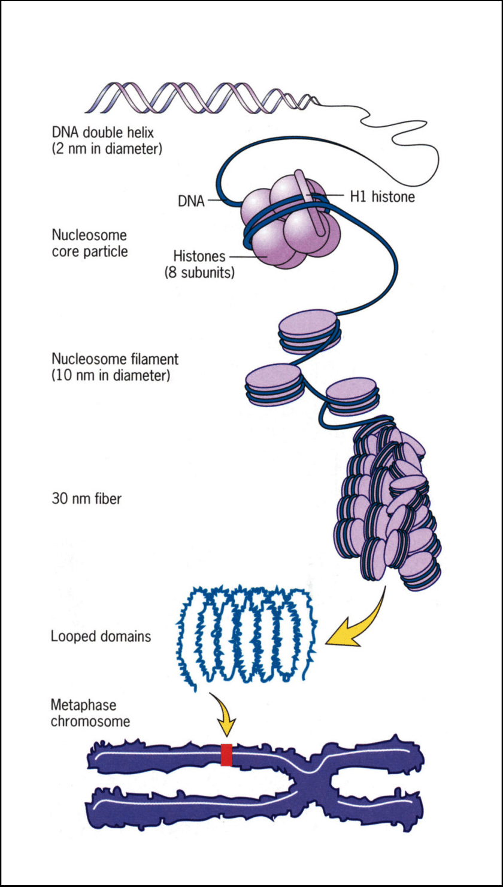
</div>

## P5 and P7 adaptors

Regardless of the library construction method, submitted libraries will consist of a sequence of interest flanked on either side by adapter constructs. On each end, these adapter constructs have flow cell binding sites, P5 and P7, which allow the library fragment to attach to the flow cell surface. All Paired-End Format sequencing on the HiSeq and All sequencing of any type on the MiSeq MUST HAVE FULL-LENGTH P5 and P7 sequences . (some of the small RNA libraries and alternative genomic library constructions use a partial P7, this is not supported by the HiSeq PE and MiSeq.)

# Percent spliced in (PSI) for short reads

The percent spliced in index (PSI) indicates the efficiency of splicing a specific exon into the transcript population of a gene. It shows the frequency/degree of a specific alternative splicing event. It is calculated by IR/(IR + ER)%, where IR is inclusion reads, ER is exclusion reads. IR means reads that support the event. ER means reads that do not support the event.

However, without normalization, the PSI of long exons would always approximate 100%. We need to normalize them by dividing the possible mapping length of a certian reads. For short reads NGS, the read length is fixed, like 100 bp, 150 bp.

So normalized IR = IR/(exon length + (read length -1)), normalized ER = ER/(read length -1).

How to understand this? For a certain read, the possible mapping read range is the exon length + read length - 1. The read can be mapped to either the upstream or downstream of the exon. For ER, the maximum range is the read length - 1. It has nothing to do with the exon length.

<b>The traditional PSI can not be calculated for long read sequencing</b>, since the read length is not fixed. You can calulate just the number of IR and ER without normalization. This may not be that strict, but it can work.

<div align=center>
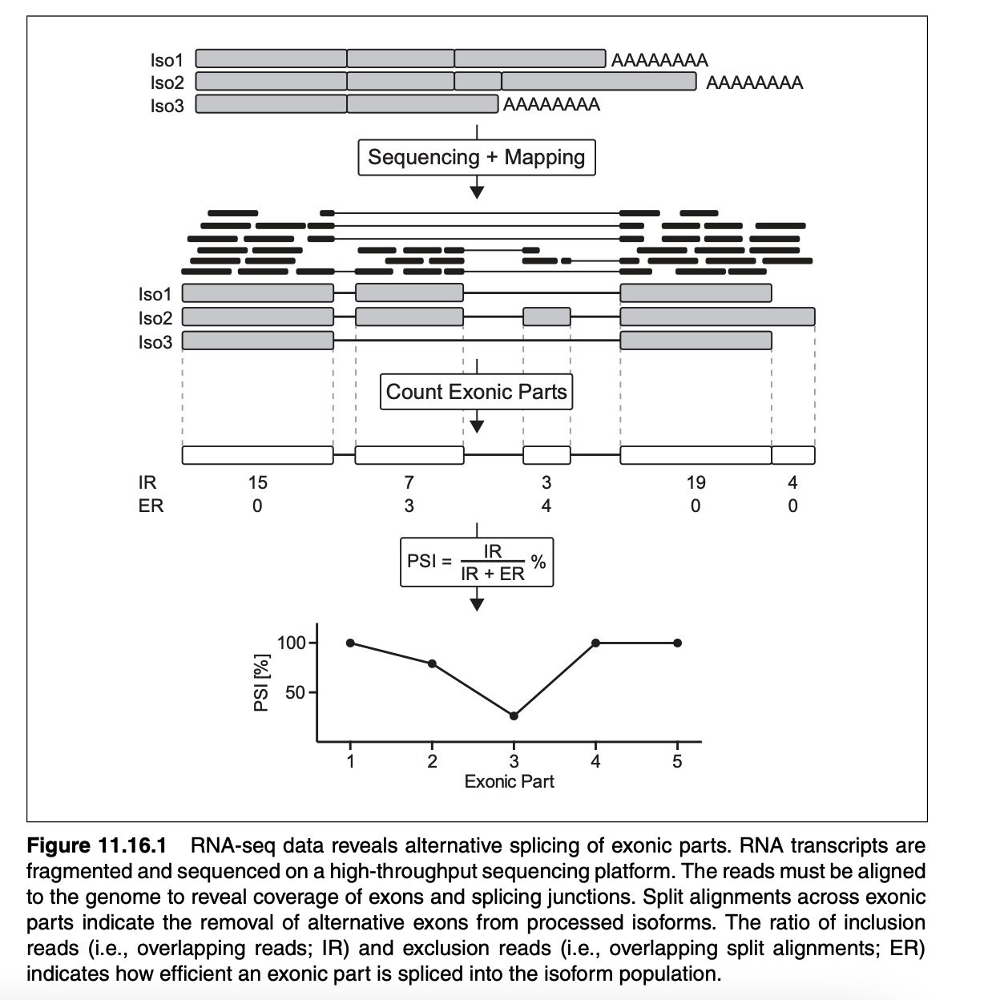
</div>

<div align=center>
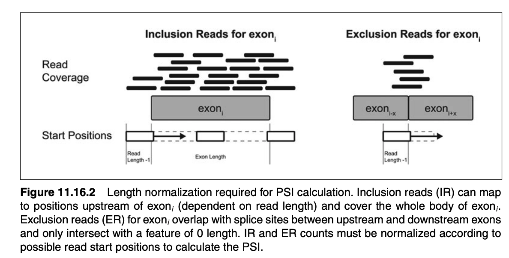
</div>

## Precision and Recall (Sensitivity)

Precision is calculated by dividing the true positives by anything that was predicted as a positive. 

Recall (or True Positive Rate) is calculated by dividing the true positives by anything that should have been predicted as positive.

Recall and Sensitivity are one and the same.

# Primary template-directed amplification (PTA)

An isothermal WGA method that reproducibly captures >95% of the genomes of single cells in a more uniform and accurate manner than existing approaches, resulting in significantly improved variant calling sensitivity and precision.

1. PTA reads are short (they are generated intentionally to avoid uneven amplification) and PTA is not compatible with long-read sequencing.  
2. PTA does create fewer artifacts (including chimera) than MDA, and this is experimentally verified in papers (https://www.nature.com/articles/s41588-022-01180-2). However, they focus on artifactual SNVs and small INDELs induced by ingle-strand dropout (SSD). 
3. Accompany with the PTA, the authors developed a tool SCAN-SNV (https://www.nature.com/articles/s41467-019-11857-8) to detect somatic SNV and small INDELs aware of MDA artifact and a tool SCAN2 (https://www.biorxiv.org/content/10.1101/2021.04.30.442032v1.abstract) to detect somatic SNV and small INDELs aware of PTA artifact. 
4. The PTA is provided as the ResolveDNA Kit in BioSkryb company, with price unlisted. They are provided as 24 and 96 Reaction Kits.  

PTA is provided as  ResolveDNA® Whole Genome Sequencing Workflow, with low-input (>4 pg to 10 ng) DNA samples.For the whole pack you need ResolveDNA Whole Genome Amplification Kit - 96 Reactions, ResolveDNA Bead Purification Kit - 96 Reactions, ResolveDNA Library Preparation Kit - 96 Reactions, ResolveDNA Multi-Use Library Adapters - 960 Reactions, ResolveDNA Cell Buffer Pack, 25 Low Bind 96 Well PCR Plates, PCR Plate Sealing Film - Pack of 100

## P2
Component	Specicification
Processor	Latest Generation CPU processor
GPU	Latest generation Ampere NVIDIA GPU for basecalling acceleration
Storage	16 TB SSD
RAM	128 GB

Self-contained benchtop device with compute inside
Powerful GPU and built-in screen
Can run up to two PromethION flow cells
Simple, preconfigured device - plug in and start running

## P 2 Solo
Up to 580 Gb (both flow cells sequencing). 290 Gb per flow cell. PromethION 2 Solo is a modular nanopore sequencing device using the same technology found in the MinION and GridION devices. It allows up to two sequencing experiments to be run concurrently or individually. The device has no integrated compute, but can be plugged into a GridION Mk1 or a stand-alone computer that meets the minimum spec.

## PromethION P24 and P48 
Up to 7,000 Gb (P24) or 14,000 Gb (P48) (all 24 or 48 flow cells sequencing respectively). 290 Gb per flow cell.

## Promoter

A promoter, as related to genomics, is a region of DNA upstream of a gene where relevant proteins (such as RNA polymerase and transcription factors) bind to initiate transcription of that gene. The resulting transcription produces an RNA molecule (such as mRNA).

<div align=center>

</div>

## REPLI-g Single Cell Kit

Yields up to 40 µg/reaction, average product length >10 kb.

## REPLI-g Advanced DNA Single Cell Kit

Yield from a single cell is 25–35 µg of amplified DNA. Saves at least 1 hour of time versus the first-generation REPLI-g Single Cell Kit (cat. nos. 150343 and 150345).

## REPLI-g UltraFast Mini Kit

Resulting in typical DNA yields of 7 μg per 20 μl reaction. Sufficient product is available for downstream genetic analysis after just 45 minutes. Input, 10 ng DNA, 0.5 µl whole blood, ~300 cells/µl.

## SAM (file format)
<div align=center>

</div>

Here is another example of SAM header part:

@HD	VN:1.0	SO:coordinate  
@SQ	SN:1	LN:249250621	AS:NCBI37	UR:file:/data/local/ref/GATK/human_g1k_v37.fasta	M5:1b22b98cdeb4a9304cb5d48026a85128  
@SQ	SN:2	LN:243199373	AS:NCBI37	UR:file:/data/local/ref/GATK/human_g1k_v37.fasta	M5:a0d9851da00400dec1098a9255ac712e  
@SQ	SN:3	LN:198022430	AS:NCBI37	UR:file:/data/local/ref/GATK/human_g1k_v37.fasta	M5:fdfd811849cc2fadebc929bb925902e5  
@RG	ID:UM0098:1	PL:ILLUMINA	PU:HWUSI-EAS1707-615LHAAXX-L001	LB:80	DT:2010-05-05T20:00:00-0400	SM:SD37743	CN:UMCORE  
@RG	ID:UM0098:2	PL:ILLUMINA	PU:HWUSI-EAS1707-615LHAAXX-L002	LB:80	DT:2010-05-05T20:00:00-0400	SM:SD37743	CN:UMCORE  
@PG	ID:bwa	VN:0.5.4  
@PG	ID:GATK TableRecalibration	VN:1.0.3471	CL:Covariates=[ReadGroupCovariate, QualityScoreCovariate, CycleCovariate, DinucCovariate, TileCovariate], default_read_group=null, default_platform=null, force_read_group=null, force_platform=null, solid_recal_mode=SET_Q_ZERO, window_size_nqs=5, homopolymer_nback=7, exception_if_no_tile=false, ignore_nocall_colorspace=false, pQ=5, maxQ=40, smoothing=1  

Here is another example of SAM alignment part, we separte each line for clear:

1:497:R:-272+13M17D24M	113	1	497	37	37M	15	100338662	0	CGGGTCTGACCTGAGGAGAACTGTGCTCCGCCTTCAG	0;==-==9;>>>>>=>>>>>>>>>>>=>>>>>>>>>>	XT:A:U	NM:i:0	SM:i:37	AM:i:0	X0:i:1	X1:i:0	XM:i:0	XO:i:0	XG:i:0	MD:Z:37  

19:20389:F:275+18M2D19M	99	1	17644	0	37M	=	17919	314	TATGACTGCTAATAATACCTACACATGTTAGAACCAT	>>>>>>>>>>>>>>>>>>>><<>>><<>>4::>>:<9	RG:Z:UM0098:1	XT:A:R	NM:i:0	SM:i: AM:i:0  X0:i:4	X1:i:0	XM:i:0	XO:i:0	XG:i:0	MD:Z:37  

19:20389:F:275+18M2D19M	147	1	17919	0	18M2D19M	=	17644	-314	GTAGTACCAACTGTAAGTCCTTATCTTCATACTTTGT	;44999;499<8<8<<<8<<><<<<><7<;<<<>><<	XT:A:R	NM:i:2	SM:i:0	AM:i:0	X0:i:4	X1:i:0	XM:i:0	XO:i:1	XG:i:2	MD:Z:18^CA19  

9:21597+10M2I25M:R:-209	83	1	21678	0	8M2I27M	=	21469	-244	CACCACATCACATATACCAAGCCTGGCTGTGTCTTCT	<;9<<5><<<<><<<>><<><>><9>><>>>9>>><>	XT:A:R	NM:i:2	SM:i:0	AM:i:0	X0:i:5	X1:i:0	XM:i:0	XO:i:1	XG:i:2	MD:Z:35  
  
The SAM is divided into two parts, the header section and the alignment section.

The comment information is not the focus of the SAM file, but is a record of the process of generating and processing the SAM file, and is specified to start with @, with different tags to indicate different information, mainly include:

@HD, a description of the standard-compliant version, the order in which the sequences are compared.  
@SQ, description of the reference sequence.  
@RG, description of the sequence (read) on which the comparison was made.  
@PG, description of the program used.  
@CO, arbitrary description information.  

Use command: samtools view -H <.bam> to see the header

In the comparison section we focus on the first 11 columns  

<b>The first column</b>: QNAME - Query template NAME is very straightforward, it is the name number of the fragment of the query, which corresponds to the name of the reads in the sequencing fastq data. For example, the above HWI-.... .2168

<b>The second column</b>: FLAG - bitwise FLAG tag that characterizes the result of the comparison in binary terms. If one or more of the following occur simultaneously, then the sum of the numbers in the corresponding first column is the number you see in the second column of the sam file. For example, if 83=64+16+2+1, it means that the reads are matched to the reference genome, both sequences are matched at the double end, and the current fragment is reversed to the reference genome.

1: means this sequence is sequenced by PE double-end sequencing  
2: means the sequence matches the reference sequence exactly, no insertion or deletion  
4: means the sequence is not mapped to the reference sequence  
8: means the other end of this sequence is not mapped to the reference sequence, for example, this sequence is R1, its corresponding R2 end sequence is not mapped to the reference sequence  
16: represents the sequence is compared to the negative chain of the reference sequence  
32: represents the sequence corresponding to the other end of the sequence is compared to the negative chain of the reference sequence  
64 : means this sequence is the R1 end sequence, read1  
128 : the sequence is the R2 end sequence, read2.  
256 : represents this sequence is not the primary comparison, a sequence may be compared to more than one position of the reference sequence, only one is the primary comparison position, the others are all secondary  
512: means this sequence failed in QC and was filtered out  
1024: means this sequence is a PCR duplicate  
2048: means this sequence has a part of chimeric PCR primers  

For example, if 99, 99=1+2+32+64, which means this sequence is R1 end sequence, which means this sequence corresponds to the other end sequence compared to the negative strand of the reference sequence, which means this sequence and the reference sequence match exactly, no insertion deletion, it is double end sequencing

<b>The third column</b>: RNAME-- Reference sequence NAME of the reference genome corresponding to the name of the chromosome or contig, scaffold. If * it means there is no result on the comparison. If @SQ header lines are present, RNAME must be present in one of the SQ-SN tag.

<b>The fourth column</b>: POS-- 1-based leftmost mapping POSition fragment leftmost mapping to the reference genome, counting from 1. If it is 0, it means there is no match.

<b>The fifth column</b>: MAPQ-- MAPping Quality mapping score, -10 log10 Pr{mapping position is wrong}- logarithmic transformation of the probability that the mapping position is wrong with a base of ten. According to this formula, we can also know that the larger the value, the lower the probability that the pairing is wrong.

<b>The sixth column</b>:  CIGAR - CIGAR string stands for Concise Idiosyncratic Gapped Alignment Report. First of all, there are the following letters that represent different meanings. Most of the meanings are easy to understand, such as sequence matching, insertions and deletions, and skipping the fragment. The document mentions that Sum of lengths of the M/I/S/=/X operations shall equal the length of SEQ.  
<div align=center>

</div>
 
For example, 251M, means the alignment of the full match 

30M3D126M3D58M37S, it means that the reads are 30bp match + 3bp missing + 126bp match + 3bp missing + 58bp match + 27bp soft clipping.  

<div align=center>

</div>

If there is a sequence that comes from a mature mRNA, if this sequence skips exactly 200bp of intron in the middle and 75bp mapped to exon before and after, what should the CIGAR value of this sequence be written?CIGAR:75M200N75M

<b>The seventh column</b>: read2's chromosome name on the reference sequence, if not available use "*", same as "="

<b>The eighth column</b>:: PNEXT: position of read2 on the reference sequence

<b>The ninth column</b>:: TLEN: length of inserted fragment  

TLEN - observed Template LENgth If all read segments are mapped to the corresponding reference sequence, the absolute value of TLEN is equal to the distance (end-start+1) between the mapped end of the template sequence and the mapped start of the template sequence (including both ends). It should be noted that the bases on the comparison do not include sof-clipped bases. If the read segment is compared to the start of the leftmost segment of the template, the TLEN field is positive, and if the comparison is to the start of the rightmost segment, it is actually an antisense strand and the TLEN field is negative. If the starting position of the comparison is the same at both ends, then any positive or negative number is assigned. If there is only a single chain, the value is 0. And the positive and negative numbers of any intermediate segments are undefined.

<div align=center>

</div

Note that the length of the inserted fragment, is the entire length below, not between R1 and R2.

<div align=center>

</div

Because the values given by sam are all at the 5 end, which is not the same as the actual in vivo DNA. So you need to add the later value, add the length of the sequence, and then subtract the starting value of the previous sequence.

<b>The 10th column</b>: SEQ: segment SEQuence. This field can be a * when the sequence is not stored. If not a * the length of the sequence must equal the sum of lengths of M/I/S/=/X operations in CIGAR. An = denotes the base is identical to the reference base. No assumptions can be made on the letter cases.

<b>The 11th column</b>: QUAL: ASCII of base QUALity plus 33 (same as the quality string in the Sanger FASTQ format). A base quality is the phred-scaled base error probability which equals −10 log10 Pr{base is wrong}. This field can be a * when quality is not stored. If not a ‘*’, SEQ must not be a ‘*’ and the length of the quality string ought to equal the length of SEQ.

<b>The tag column</b>: At the end of the SAM, you will see something like: XT:A:U NM:i:0 SM:i:37 AM:i:0 X0:i:1 X1:i:0 XM:i:0 XO:i:0 XG:i:0 MD:Z:37. TAGs are optional fields on a SAM/BAM Alignment. A TAG is comprised of a two character TAG key, they type of the value, and the value. A user can also use any additional tags to store any information they want. TAGs starting with X, Y, or Z are reserved to be user defined.

Example:  

XT:A:U  - user defined tag called XT.  It holds a character.  The value associated with this tag is 'U'.  
NM:i:2  - predefined tag NM means: Edit distance to the reference (number of changes necessary to make this equal the reference, excluding clipping)  
XS:A:+, XS:A- -XS to indicate the genomic strand that produced the RNA from which the read was sequenced. When your sequencing is unstranded, mappers can still add a strand to a read if it crosses a splice site, and that splice site has a canonical splice site sequence - it can use this sequence to work out which way the RNA is going. All spliced reads would contain the XS tag.  
SA: BWA uses SA tag for marking chimeric reads. 

## SA tag in SAM file

After aligning with bwa mem, chimeric reads will have an SA tag. Their format is: SA:Z:(rname ,pos ,strand ,CIGAR ,mapQ ,NM ;)
Each element in the list represents a part of the chimeric alignment. Conventionally, at a supplementary line, the first element points to the primary line. Strand is either ‘+’ or ‘-’, indicating forward/reverse strand, corresponding to FLAG bit 0x10. Pos is a 1-based coordinate.

Example:

HWI-ST387:139:C03WJABXX:5:2108:15315:193815 16 scf7180000067989 85156 60 60M41S * 0 0 TTGAAGTCAAGAAAGTGGTAAAGAGAGATTAATAGGGGTATCTCAGCTACAACAAATATTATATTAAATTAAATGGTTAATCTTGCTTTGCTCACCATAAA * NM:i:2 MD:Z:31G1C26 AS:i:50 XS:i:0 <b>SA:Z:scf7180000067989,85273,-,54S47M,60,1</b>;

HWI-ST387:139:C03WJABXX:5:2108:15315:193815 272 scf7180000067989 85273 60 54H47M * 0 0 AATATTATATTAAATTAAATGGTTAATCTTGCTTTGCTCACCATAAA * NM:i:1 MD:Z:11T35 AS:i:42 XS:i:22 <b>SA:Z:scf7180000067989,85156,-,60M41S,60,2</b>;

scf7180000067989 is the reference name, 85156 is the position, - is the strand, 60M41S is the cigar, 60 is the map quality, 2 is the NM. Each SA tag will store information of another alignments in a chimeric alignment, other itself.

The software TransIndel (Yang et al., 2018, BMC genomics) used the SA tag of BWA-MEM to detect Indel. The algorithm is as follows:
Sometimes it is hard to distinguish splicing and deletion, for a true deletion the length of left mapped + lengths of right mapped must be equal to the length of the read itself.

<div align=center>

</div

.  

## scNMT-seq (single-cell nucleosome, methylation and transcription sequencing)

The main process of scNMT-seq can be summarized as follows:

1. Cell collection and methyltransferase reaction: Cells are collected into a methyltransferase reaction mixture and incubated at 37°C for 15 minutes. The reaction is stopped, and RNA is preserved using RLT plus.

2. scM&T-seq library preparation: mRNA is captured using Smart-seq2 oligo-dT, and the lysate containing gDNA is transferred to a separate PCR plate. Reverse transcription, PCR amplification, and cDNA purification are performed. Libraries are prepared using the Nextera XT Kit. In parallel, genomic DNA is purified and bisulfite-converted using the EZ Methylation Direct MagBead kit.

3. First and second strand synthesis of converted DNA, and library amplification: The converted DNA undergoes first strand synthesis using klenow exo- enzyme and is purified using AMPure XP beads. The second strand synthesis is performed, and products are purified again. The final PCR amplification is carried out, and scBS-seq libraries are purified using AMPure XP beads before pooling and sequencing.

The amplification will not remove the already-fixed methylation information.

<div align=center>
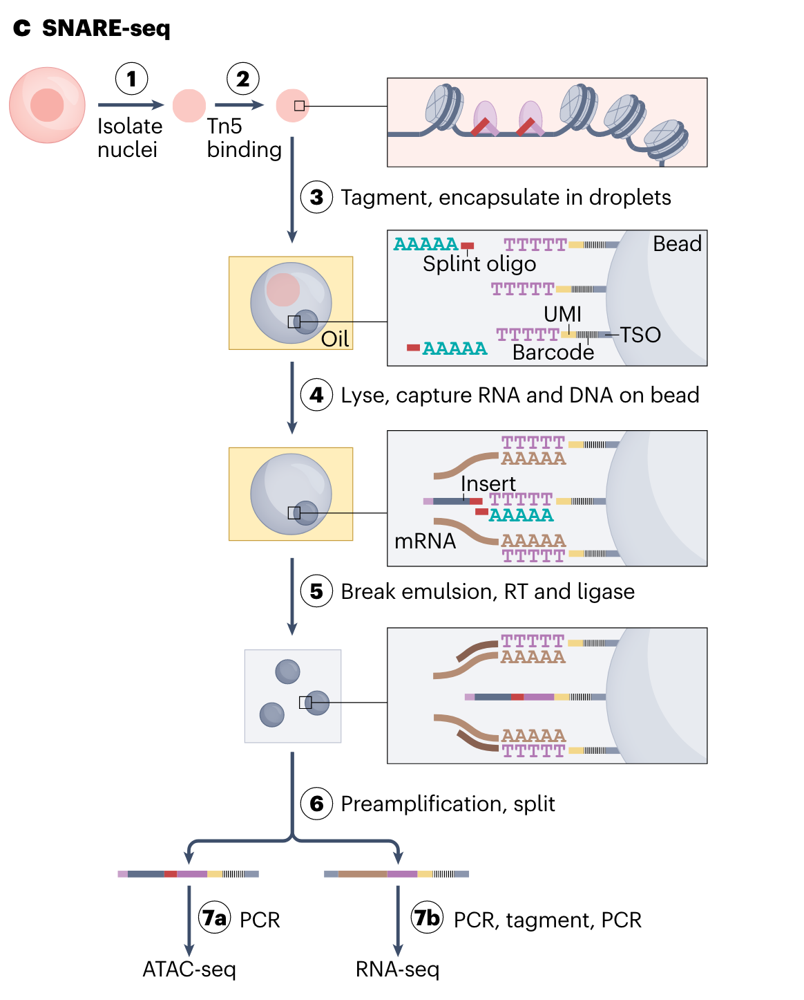
</div

.
## Slippage during polymerase chain reaction amplification  

Slippage during PCR, also known as replication slippage, is a form of mutation that causes trinucleotide or dinucleotide amplification and sometimes even contraction during DNA replication, resulting in tandem repeat sequences.

## SMART (Switching Mechanism at the 5′ end of RNA Template) technology
leverages the template-switching capability of certain reverse transcriptases (RTs) to capture full-length sequence information from RNA or DNA templates and incorporate adapter sequences during first-strand cDNA synthesis. The adapter sequences serve as primer-binding sites during subsequent rounds of PCR amplification. It has full-length template coverage, high-quality sequencing libraries.

<div align=center>

</div
.
        
.
## SMART (Switching Mechanism at the 5′ end of RNA Template) seq 2

Conventional cDNA construction methods usually result in an underrepresentation of the 5’ ends of cDNA.

1 - Single cell sorting: Smart-seq uses flow cytometry for cell sorting, with a maximum throughput of 96 cells at a time.

2 - Cell Lysis: Cell lysis is performed in cell lysis solution.

3 - Reverse transcription (one-strand synthesis): RNA with polyA tails (mainly mRNA) is reverse transcribed using Oligo(dT) primer. Since a mouse-derived reverse transcriptase ( Moloney Murine Leukemia Virus ) is used for reverse transcription, three Cs are added to the 3 end of the cDNA strand.

4 -Template replacement (second-strand synthesis): This step synthesizes the second strand of cDNA using TSO (template-switching oligo) primers, thus replacing the RNA complementary to the first-strand cDNA. TSO also carries the primers required for PCR (green part of the figure).

5 - PCR amplification: This step performs a light cDNA enrichment, and amplification of cDNA to the ng level is sufficient.

<b>For the following 6 and 7, please see Tn5 transposase (Tnp) for NGS sequencing library construction. They are the same.</b>

6 - Labeling: The DNA is interrupted using a modified, highly active Tn5 transposase while adding the junction to both ends of the cDNA. The DNA fragment after labeling is usually 200-600bp.

7 - PCR Enrichment & On-board Sequencing: After the last PCR amplification, the DNA is ready for onboard sequencing. Smart-seq2 uses the usual Illumina sequencer, as its library ends up being similar to the usual bulk RNA-seq.

<div align=center>

</div
        
<div align=center>

</div
.

..       
## SNV (Single nucleotide variant)
A SNV can be rare in one population but common in a different population. Sometimes SNVs are known as single nucleotide polymorphisms (SNPs), although SNV and SNPs are not interchangeable. To qualify as a SNP, the variant must be present in at least 1% of the population.

## Soft clipping and hard clipping

About soft clipping and hard clipping, it means that when query matching, some sequences are not matched completely, but soft clipping will keep the unmatched part afterwards, and hard clipping can remove the matched part completely. For example, when there is only part of the fragment is compared to the reference sequence when comparing. The difference is that a Soft Clip will eventually retain the corresponding sequence in the sequence that follows, while a Hard Clip will delete the fragment directly in the sequence that follows. BWA-MEM uses soft clipping CIGAR operation for supplementary alignments. By default, BWA-MEM uses soft clipping for the primary alignment and hard clipping for supplementary alignments.

Hard Clip exists with the intention of reducing the redundancy of BAM file sequences, for example, there is a read which can be compared to two places A, B. In place A, it is 60M90S, and in place B it is 60H90M, at this time a read actually already has the complete sequence information in position A, and the information in position B is actually redundant. So a marker form like Hard Clip can be introduced at location B, and it will be able to mark the sequence at location B as secondary.

## Splicing junctions

Key to defining the complexity of alternative splicing within a gene is the identification of splice junctions (SJs), which occur at exon-exon boundaries and are typically characterized in pairs representing both the donor site (5’ intron boundary to 3’ upstream exon boundary) and acceptor site (3’ intron boundary to 5’ downstream exon boundary).

## Sticky ends
One strand is longer than the other (typically by at least a few nucleotides), such that the longer strand has bases which are left unpaired. The sticky ends, a.k.a. cohesive ends, have unpaired DNA nucleotides on either 5’- or 3’- strand, which are known as overhangs. These overhangs are most often generated by a staggered cut of restriction enzymes. Sticky ends are generally more desired in cloning technology where a DNA ligase is used to join two DNA fragments into one, because the yield and specificity of ligation using sticky ends is significantly higher that with blunt ends.
  
## Structural variation  
Genomic structural variation is the variation in structure of an organisms chromosome. It consists of many kinds of variation in the genome of one species, and usually includes microscopic and submicroscopic types, such as deletions, duplications, copy-number variants, insertions, inversions and translocations. Originally, a structure variation affects a sequence length about 1kb to 3Mb, which is larger than SNPs and smaller than chromosome abnormality (though the definitions have some overlap). However, the operational range of structural variants has widened to include events > 50bp.The definition of structural variation does not imply anything about frequency or phenotypical effects. Many structural variants are associated with genetic diseases, however many are not.Recent research about SVs indicates that SVs are more difficult to detect than SNPs.

## Structural variation - Inversion

Why are inversions defined as the reverse complement and not just the reverse of the reference? If an inversion were just reversed then there would be 3' -> 3' bonds and 5' -> 5' bonds. That's why inversions are reverse complemented, you then maintain the normal 5'->3' direction.

## Structural variation - Novel sequence insertion

An insertion the sequence of which cannot be mapped to the reference genome.

## Structural variation - SURVIVIOR software merge translocation

Here is a translocation result from SVIM:

chr1	876903	svim.BND.3	N	[chr20:29368734[N	6	PASS	SVTYPE=BND;SUPPORT=5;STD_POS1=.;STD_POS2=.	GT:DP:AD	./.:.:.,.

Here is a translocation result from pbsv:

chr1	876903	pbsv.BND.chr1:876903-chr20:29368734	G	[chr20:29368734[G	.	PASS	SVTYPE=BND;CIPOS=0,0;MATEID=pbsv.BND.chr20:29368734-chr1:876903	GT:AD:DP	0/1:30,8:38

Here is merged result from SURVIVOR:

chr1	876903	svim.BND.3	N	N[chr20:29368734[	6	PASS	SUPP=2;SUPP_VEC=11;SVLEN=0;SVTYPE=TRA;SVMETHOD=SURVIVOR1.0.7;CHR2=chr20;END=29368734;CIPOS=0,0;CIEND=0,0;STRANDS=++	GT:PSV:LN:DR:ST:QV:TY:ID:RAL:AAL:CO	0/1:NA:28491831:0,0:++:.:TRA:pbsv.BND.chr1_876903-chr20_29368734:NA:NA:chr1_876903-chr20_29368734	./.:NA:28491831:0,0:++:6:TRA:svim.BND.3:NA:NA:chr1_876903-chr20_29368734

Here is a detailed explanation of each field in the merged VCF line:

1. chr1: This is the name of the chromosome on which the variant is located. In this case, the variant is located on chromosome 1.
2. 876903: This is the position of the variant on the chromosome, in base pairs. In this case, the variant is located at position 876903 on chromosome 1.
3. svim.BND.3: This is the ID of the variant as called by the SVIM software. It is a breakend variant with ID 3.
4. N: This is the reference allele at the position of the variant on chromosome 1.
5. N[chr20:29368734[G: This is the alternate allele at the position of the variant on chromosome 1. It indicates that the variant involves a breakend on chromosome 1 and a breakpoint on chromosome 20 at position 29368734.
6. 6: This is the quality score of the variant.
7. PASS: This field indicates whether the variant passed filtering. In this case, the variant passed filtering.
8. SUPP=2;SUPP_VEC=11;SVLEN=0;SVTYPE=TRA;SVMETHOD=SURVIVOR1.0.7;CHR2=chr20;END=29368734;CIPOS=0,0;CIEND=0,0;STRANDS=++: This field contains additional information about the variant. The SUPP field indicates the number of supporting reads for the variant. The SUPP_VEC field indicates the number of supporting read pairs.
9. The SVLEN field indicates the length of the variant, in base pairs. In this case, the value is 0, which indicates that the variant is 0 base pairs in length.
10. The SVTYPE field indicates the type of structural variant. In this case, the value is TRA, which indicates that the variant is a translocation.
11. The SVMETHOD field indicates the software that was used to call the variant. In this case, the value is SURVIVOR1.0.7, which indicates that the variant was called using the SURVIVOR software.
12. The CHR2 field indicates the second chromosome involved in the variant, if applicable. In this case, the value is chr20, which indicates that chromosome 20 is also involved in the variant.
13. The END field indicates the end position of the variant on the chromosome. In this case, the value is 29368734, which indicates that the variant ends at position 29368734 on chromosome 20.
14. The CIPOS and CIEND fields indicate the confidence intervals for the start and end positions of the variant, respectively. In this case, the values are 0,0, which indicates that the confidence intervals for the start and end positions are 0 base pairs.
15. The STRANDS field indicates the strands on which the variant was observed. In this case, the value is ++, which indicates that the variant was observed on both strands.

GT:PSV:LN:DR:ST:QV:TY:ID:RAL:AAL:CO	0/1:NA:28491831:0,0:++:.:TRA:pbsv.BND.chr1_876903-chr20_29368734:NA:NA:chr1_876903-chr20_29368734	./.:NA:28491831:0,0:++:6:TRA:svim.BND.3:NA:NA:chr1_876903-chr20_29368734

the explanation for the genotype, phase set, and other information for the two samples:

For the first sample:

+ The ID field indicates the ID of the variant. In this case, the value is pbsv.BND.chr1_876903-chr20_29368734, which is the ID of the variant as called by the PBSV software.
+ The RAL field indicates the reference alleles of the variant. In this case, the value is NA, which indicates that the reference alleles are not available.
+ The AAL field indicates the alternate alleles of the variant. In this case, the value is NA, which indicates that the alternate alleles are not available.
+ The CO field indicates the components of the variant. In this case, the value is chr1_876903-chr20_29368734, which indicates that the variant is a breakend involving chromosome 1 and chromosome 20 and spanning from position 876903 on chromosome 1 to position 29368734 on chromosome 20.

For the second sample:

+ The GT field indicates the genotype of the sample. In this case, the value is ./, which indicates that the genotype of the sample is missing.
+ The PSV field indicates the phase set of the sample. In this case, the value is NA, which indicates that the phase set is not available.
+ The LN field indicates the length of the variant. In this case, the value is 28491831, which indicates that the variant is 28491831 base pairs in length.
+ The DR field indicates the number of supporting reads for the variant. In this case, the value is 0,0, which indicates that there are no supporting reads for the variant.
+ The ST field indicates the strands on which the variant was observed. In this case, the value is ++, which indicates that the variant was observed on both strands.
The QV field indicates the quality score of the variant. In this case, the value is 6, which is the quality score of the variant as called by the SVIM software.
+ The TY field indicates the type of variant. In this case, the value is TRA, which indicates that the variant is a translocation.
+ The ID field indicates the ID of the variant. In this case, the value is svim.BND.3, which is the ID of the variant as called by the SVIM software.
+ The RAL field indicates the reference alleles of the variant. In this case, the value is NA, which indicates that the reference alleles are not available.
+ The AAL field indicates the alternate alleles of the variant. In this case, the value is NA, which indicates that the alternate alleles are not available.
+ The CO field indicates the components of the variant. In this case, the value is chr1_876903-chr20_29368734, which indicates that the variant is a breakend involving chromosome 1 and chromosome 20 and spanning from position 876903 on chromosome 1 to position 29368734 on chromosome 20.

## Structural variation detection algorithm

<div align=center>
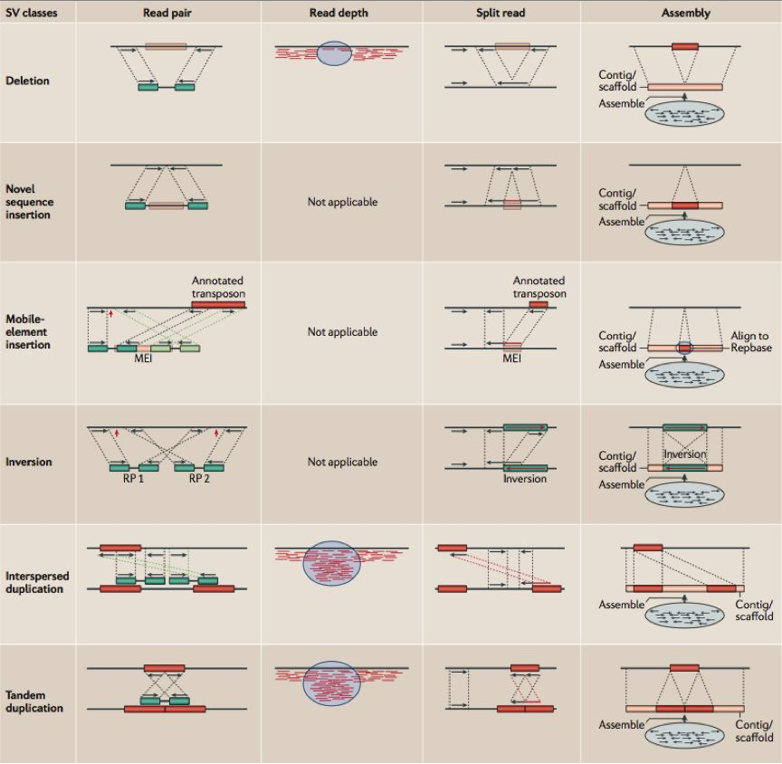
</div

## Supplementary Alignment

This is the SA tag. A chimeric reads but not a representative reads. 

## T7 promoter and T7 RNA polymerase  

T7 is a promoter (T7 promoter), a strong promoter from T7 phage that can specifically respond to T7 RNA polymerase, and is a sequence that initiates transcription of the T7 phage gene.  

T7 RNA polymerase is highly promoter specific and only transcribes DNA or DNA copies downstream of the T7 promoter in T7 phages. t7 RNA polymerase selectively activates transcription of the T7 phage promoter and synthesizes mRNA at a rate about 5 times faster than that of the common E. coli RNA polymerase.  

In vitro transcription using T7 bacteriophage polymerase is widely used in molecular biology. T7 RNA polymerase is very selective and efficient, resulting both in a high frequency of transcription initiation and effective elongation. These features result in an RNA elongation that is approximately five-fold faster than for E. coli RNA polymerase. 

## Tn5 transposon 

Tn5 transposons were discovered in <i>Escherichia coli</i> and consist of a core sequence encoding three antibiotics (neomycin, bleomycin, and streptomycin) and two inverted IS50 sequences, IS50L and IS50R, which encode a Tn5 transposase (Tnp). IS50 has two pairs of 19-bp inverted ends that are outside ends (OEs) and inside ends (IEs). These inverted OEs are target sites of Tn5 transposase. When transposition occurs, transposases bind to the OEs of the Tn5 transposon, forming Tnp-OE complexes and then the two complexes join together. The C-terminus of Tnp interacts and dimerizes to form a synaptic complex that has the ability to cleave DNA. Tnps that bind to the right and left ends are responsible for catalyzing the hydrolysis of the phosphodiester bond at the left and right ends, respectively. Tnp activates water molecules that hydrolyze the DNA strand and forms a 3′-OH nucleophilic group at the 5′ ends of transposons, which in turn attacks the complementary strand to form a hairpin structure. Finally, the synaptic complex captures target DNA and finishes the strand transfer by nucleophilic attack on both strands of the target DNA with 3’ OH groups of the Tn5 transposon.

Outside end（OE）sequences composed of 19 bases that are recognized by Tnp and involved in the transposition of the entire Tn5.

<div align=center>

</div

.
## Tn5 transposase (Tnp)
Linear Amplification via Transposon Insertion (LIANTI) uses Tn5 transposase for linear amplification, haploid typing, and structural variation detection. The “cut and paste” function of Tn5 is widely used in genomics research. Subsequently, studies have shown that only OE sequences and Tn5 transposases are required for transposition in vitro. Tn5 transposases can randomly insert adaptors/barcodes into DNA, and the resulting DNA molecules are ready for PCR amplification and sequencing.

## Tn5 transposase (Tnp) for NGS sequencing library construction  
The key of transposase method library building technology is Tn5 transposon, a bacterial transposon, which is essentially a DNA fragment containing several resistance genes and edited transposase genes. The traditional library construction method requires DNA fragmentation, end repair, splice ligation, library amplification, and multi-step purification, etc. When Tn5 is used for library construction, the multi-step reactions of DNA fragmentation, end repair, and splice ligation can be transformed into a one-step reaction, shortening the library construction time.
  
By combining the P5 and P7 end partial junction sequences (Adapter 1/2) with transposon end sequences (OE), Tnp recognizes transposon ends to form a Tn5 transposon complex with P5 and P7 end partial junctions (containing two dimer-forming Tnp and two partial P5, P7 sequences). The complex recognizes the target sequence of the acceptor DNA, cuts the acceptor DNA (namely ,the DNA you want to sequence), and inserts the carried donor DNA to form DNA with a P5 part adapter Adapter 1 at one end and a P7 part adapter Adapter 2 at the other end, which is then added by PCR barcoding, and the rest of the linker form a DNA library with complete linkers at the P5 and P7 ends. The cut formed by the transposition is then patched using DNA polymerase. This product is amplified by two primer pairs, N5 (N5XX) and N7 (N7XX), and P5 and P7 (PCR Primer Mix), and the product is sorted and purified to form a sequencer-ready library, with N5 (N5XX) and N7 (N7XX) responsible for adding the barcode, and P5 and P7 (PCR Primer Mix) responsible for recovering the full-length sequences of P5 and P7.

<div align=center>

</div
  
The final structure:

<div align=center>

</div  

.

## Tn5 transposase (Tnp) for PacBio sequencing library construction (PCR-free)
This procedure does not include whole genom amplification, could not used ditectly for PCR.

A schematic overview of the SMRT-Tag approach. Hairpin adaptor-loaded triple mutant Tn5 transposase is loaded and used to fragment DNA into 2 – 10 kilobase (kb) fragments. After removing Tn5 transposase, an optimized gap repair is used to fill the resulting 9 bp gaps on either side of the molecule, and an exonuclease treatment is used to purify repaired covalently closed templates, which are sequenced on the PacBio Sequel II instrument. 
  
Crucially, combining tagmentation with optimized gap repair allowed the streamlined creation of PacBio libraries from 80 – 100 ng DNA (a minimum of 15,000 human cell equivalents) compared to current protocols that require > 0.5 – 5 μg DNA (a minimum of ∼200,000 human cell equivalents). 

<div align=center>

</div

 .
 
## Tn5 transposase (Tnp) for PacBio sequencing library construction (PCR-based) a. k. a. SNOOTH-SEQ  
Individual cells were collected with a microcapillary connected to a mouth pipette and washed by transferring them into droplets of 1 mg/mL phosphate-buffered saline-bovine serum albumin for three times before lysis. The 2.5-μL lysis reaction consists of 0.25-μL 100mM Tris-EDTA (1M Tris + 0.1M EDTA), 0.125μL Qiagen protease, 0.075μL 10% triton X-100, 0.05μL1MKCL,and2μLH2O. The cell lysis was carried out at 50°C for 3 h to digest the proteins binding on the gDNA and then 70°C for 30 min to inactivate the protease. After that, a 7.5-μL tagmentation mixture including 2 μL 5×TAPS_PEG8K (50 mM TAPS-NaOH (or KOH), pH 8.3 (RT), 25 mM MgCl2, 40% PEG8K), and 1μL0.2ng/μL adaptor conjuncted Tn5 enzyme (Vazyme, Cat. S601-01) was added into each cell lysate. The tagmentation reaction was carried out at 55°C for 10min, followed by adding 2.5-μL0.2%SDSand standing at room temperature for 5min to stop tagmentation, releasing the fragmented gDNA. Then, strand displacement of the Tn5 adaptors and amplification of the fragmented gDNA was carried out using 0.025U/μLTksGflexDNA Polymerase (TAKARA, Cat. R060B), 560nM I5 PCR primer which containing 16 bp cell barcode (5′ AATGATACGGCGACCACCGAGATCTNNNNNNNNNNNNNNN NTCGTCGGCAGCGTC3′). The PCR program was 72°C 3min, 98°C 1 min, and then 20 cycles of 98°C for 15s, 60°C for 30s, and 68°C for 5min. After that, gDNA amplicons using different barcode primers were pooled together and purified with 0.4 volume of Ampure PB beads (Pacific Biosciences Ref. No. 100-265-900) for twice. These purified amplicons were quantifiedusingQubit,andabout1μg amplified products was used to construct libraries for Pacbio sequencing using SMRTbell Template Prep Kit v.1.0-SPv3 (Pacific Biosciences Ref. No. 100-991-900).

Because of the transposon approach, adaptor has been added, each sequence is ended with part of the sequence of adaptor, so there is no need for random primers to amplify the whole genome, but only the I5 primer that specifically identifies the adaptor is needed, except that barcode needs to be added to label multiple cells to facilitate the difference after hybrid sequencing, saving cost and improving throughput
 
## Transporter associated with antigen processing (TAP)
Transporter associated with antigen processing (TAP) protein complex belongs to the ATP-binding-cassette transporter family. It delivers cytosolic peptides into the endoplasmic reticulum (ER), where they bind to nascent MHC class I molecules.

## Untranslated region (UTR)
Refers to either of two sections, one on each side of a coding sequence on a strand of mRNA. If it is found on the 5' side, it is called the 5' UTR (or leader sequence), or if it is found on the 3' side, it is called the 3' UTR (or trailer sequence). mRNA is RNA that carries information from DNA to the ribosome, the site of protein synthesis (translation) within a cell. The mRNA is initially transcribed from the corresponding DNA sequence and then translated into protein. However, several regions of the mRNA are usually not translated into protein, including the 5' and 3' UTRs.

In protein-coding genes, the exons include both the protein-coding sequence and the 5′- and 3′-untranslated regions (UTR). 

Normal stop codons and the 3' UTR are usually located in the last exon of the sequence 

<div align=center>

</div

.
## Variant allele frequency (VAF)
The fraction of genome copies in the (tumor or control) sample affected by the variant, is either 0.0, 0.5, or 1.0 for germline variants, reflecting absence, heterozygosity, or homozygosity, respectively. In contrast, allele frequencies of somatic variants vary across the whole range from 0.0 to 1.0, depending on the clonal structure of the tumor sample and its impurity (the ratio of healthy genome copies in the tumor sample).
  
The variant allele frequency (VAF; also known as variant allele fraction) is used to infer whether a variant comes from somatic cells or inherited from parents when a matched normal sample is not provided. A variant is potentially a germline mutation if the VAF is approximately 50% or 100%.
  
## VCF (file format)
VCF is a text file format (most likely stored in a compressed manner). It contains meta-information lines, a header line, and then data lines each containing information about a position in the genome.

```
##fileformat=VCFv4.0
##fileDate=20090805
##source=myImputationProgramV3.1
##reference=1000GenomesPilot-NCBI36
##phasing=partial
##INFO=<ID=NS,Number=1,Type=Integer,Description="Number of Samples With Data">
##INFO=<ID=DP,Number=1,Type=Integer,Description="Total Depth">
##INFO=<ID=AF,Number=.,Type=Float,Description="Allele Frequency">
##INFO=<ID=AA,Number=1,Type=String,Description="Ancestral Allele">
##INFO=<ID=DB,Number=0,Type=Flag,Description="dbSNP membership, build 129">
##INFO=<ID=H2,Number=0,Type=Flag,Description="HapMap2 membership">
##FILTER=<ID=q10,Description="Quality below 10">
##FILTER=<ID=s50,Description="Less than 50% of samples have data">
##FORMAT=<ID=GT,Number=1,Type=String,Description="Genotype">
##FORMAT=<ID=GQ,Number=1,Type=Integer,Description="Genotype Quality">
##FORMAT=<ID=DP,Number=1,Type=Integer,Description="Read Depth">
##FORMAT=<ID=HQ,Number=2,Type=Integer,Description="Haplotype Quality">
#CHROM POS     ID        REF ALT    QUAL FILTER INFO                              FORMAT      NA00001        NA00002        NA00003
20     14370   rs6054257 G      A       29   PASS   NS=3;DP=14;AF=0.5;DB;H2           GT:GQ:DP:HQ 0|0:48:1:51,51 1|0:48:8:51,51 1/1:43:5:.,.
20     17330   .         T      A       3    q10    NS=3;DP=11;AF=0.017               GT:GQ:DP:HQ 0|0:49:3:58,50 0|1:3:5:65,3   0/0:41:3
20     1110696 rs6040355 A      G,T     67   PASS   NS=2;DP=10;AF=0.333,0.667;AA=T;DB GT:GQ:DP:HQ 1|2:21:6:23,27 2|1:2:0:18,2   2/2:35:4
20     1230237 .         T      .       47   PASS   NS=3;DP=13;AA=T                   GT:GQ:DP:HQ 0|0:54:7:56,60 0|0:48:4:51,51 0/0:61:2
20     1234567 microsat1 GTCT   G,GTACT 50   PASS   NS=3;DP=9;AA=G                    GT:GQ:DP    0/1:35:4       0/2:17:2       1/1:40:3  
```

This example shows in order (1) a good simple SNP, (2) a possible SNP that has been filtered out because its quality is below 10, (3) a site at which two alternate alleles are called, with one of them (T) being ancestral (possibly a reference sequencing error), (4) a site that is called monomorphic reference (i.e. with no alternate alleles), and (5) a microsatellite with two alternative alleles, one a deletion of 3 bases (TCT), and the other an insertion of one base (A). Genotype data are given for three samples, two of which are phased and the third unphased, with per sample genotype quality, depth and haplotype qualities (the latter only for the phased samples) given as well as the genotypes. The microsatellite calls are unphased.

### 1. Meta-information lines
File meta-information is included after the ## string, often as key=value pairs.

The ‘fileformat’ field is always required and should detail the VCF format version number. For example, for VCF version 4.0, this line should read:

##fileformat=VCFv4.0

It is strongly encouraged that information lines describing the INFO, FILTER and FORMAT entries used in the body of the VCF file be included in the meta-information section. Although they are optional, if these lines are present then they must be completely well-formed.

INFO fields should be described as follows (all keys are required):

##INFO=<ID=ID,Number=number,Type=type,Description=”description”>

Possible Types for INFO fields are: Integer, Float, Flag, Character, and String.

The Number entry is an Integer that describes the number of values that can be included with the INFO field. For example, if the INFO field contains a single number, then this value should be 1. However, if the INFO field describes a pair of numbers, then this value should be 2 and so on. If the number of possible values varies, is unknown, or is unbounded, then this value should be ‘.’. Possible Types are: Integer, Float, Character, String and Flag. The ‘Flag’ type indicates that the INFO field does not contain a Value entry, and hence the Number should be 0 in this case. The Description value must be surrounded by double-quotes.

FILTERs that have been applied to the data should be described as follows:

##FILTER=<ID=ID,Description=”description”>

Likewise, Genotype fields specified in the FORMAT field should be described as follows:

##FORMAT=<ID=ID,Number=number,Type=type,Description=”description”>

Possible Types for FORMAT fields are: Integer, Float, Character, and String.

### 2. The header line syntax
The header line names the 8 fixed, mandatory columns. These columns are as follows:

#CHROM
POS
ID
REF
ALT
QUAL
FILTER
INFO
  
If genotype data is present in the file, these are followed by a FORMAT column header, then an arbitrary number of sample IDs. The header line is tab-delimited.

### 3. Data lines
### Fixed fields
There are 8 fixed fields per record. All data lines are tab-delimited. In all cases, missing values are specified with a dot (“.”). Fixed fields are:

CHROM chromosome: an identifier from the reference genome. All entries for a specific CHROM should form a contiguous block within the VCF file.(Alphanumeric String, Required)
  
POS position: The reference position, with the 1st base having position 1. Positions are sorted numerically, in increasing order, within each reference sequence CHROM. (Integer, Required)
  
ID semi-colon separated list of unique identifiers where available. If this is a dbSNP variant it is encouraged to use the rs number(s). No identifier should be present in more than one data record. If there is no identifier available, then the missing value should be used. (Alphanumeric String)
  
REF reference base(s): Each base must be one of A,C,G,T,N. Bases should be in uppercase. Multiple bases are permitted. The value in the POS field refers to the position of the first base in the String. For InDels, the reference String must include the base before the event (which must be reflected in the POS field). (String, Required).
  
ALT comma separated list of alternate non-reference alleles called on at least one of the samples. Options are base Strings made up of the bases A,C,G,T,N, or an angle-bracketed ID String (”<ID>“). If there are no alternative alleles, then the missing value should be used. Bases should be in uppercase. (Alphanumeric String; no whitespace, commas, or angle-brackets are permitted in the ID String itself)
  
QUAL phred-scaled quality score for the assertion made in ALT. i.e. give -10log_10 prob(call in ALT is wrong). If ALT is ”.” (no variant) then this is -10log_10 p(variant), and if ALT is not ”.” this is -10log_10 p(no variant). High QUAL scores indicate high confidence calls. Although traditionally people use integer phred scores, this field is permitted to be a floating point to enable higher resolution for low confidence calls if desired. (Numeric)
  
FILTER filter: PASS if this position has passed all filters, i.e. a call is made at this position. Otherwise, if the site has not passed all filters, a semicolon-separated list of codes for filters that fail. e.g. “q10;s50” might indicate that at this site the quality is below 10 and the number of samples with data is below 50% of the total number of samples. “0” is reserved and should not be used as a filter String. If filters have not been applied, then this field should be set to the missing value. (Alphanumeric String)
  
INFO additional information: (Alphanumeric String) INFO fields are encoded as a semicolon-separated series of short keys with optional values in the format: <key>=<data>[,data]. Arbitrary keys are permitted, although the following sub-fields are reserved (albeit optional):
  
AA ancestral allele
  
AC allele count in genotypes, for each ALT allele, in the same order as listed
  
AF allele frequency for each ALT allele in the same order as listed: use this when estimated from primary data, not called genotypes
  
AN total number of alleles in called genotypes
  
BQ RMS base quality at this position
  
CIGAR cigar string describing how to align an alternate allele to the reference allele
  
DB dbSNP membership
  
DP combined depth across samples, e.g. DP=154
  
END end position of the variant described in this record (esp. for CNVs)
  
H2 membership in hapmap2
  
MQ RMS mapping quality, e.g. MQ=52
  
MQ0 Number of MAPQ == 0 reads covering this record
  
NS Number of samples with data
  
SB strand bias at this position
  
SOMATIC indicates that the record is a somatic mutation, for cancer genomics
  
VALIDATED validated by follow-up experiment
  
etc. The exact format of each INFO sub-field should be specified in the meta-information (as described above).

Example for an INFO field: DP=154;MQ=52;H2. Keys without corresponding values are allowed in order to indicate group membership (e.g. H2 indicates the SNP is found in HapMap 2). It is not necessary to list all the properties that a site does NOT have, by e.g. H2=0.

### Genotype fields
If genotype information is present, then the same types of data must be present for all samples. First a FORMAT field is given specifying the data types and order. This is followed by one field per sample, with the colon-separated data in this field corresponding to the types specified in the format. The first sub-field must always be the genotype (GT).

As with the INFO field, there are several common, reserved keywords that are standards across the community:

GT genotype, encoded as alleles values separated by either of ”/” or “|”, e.g. The allele values are 0 for the reference allele (what is in the reference sequence), 1 for the first allele listed in ALT, 2 for the second allele list in ALT and so on. For diploid calls examples could be 0/1 or 1|0 etc. For haploid calls, e.g. on Y, male X, mitochondrion, only one allele value should be given. All samples must have GT call information; if a call cannot be made for a sample at a given locus, ”.” must be specified for each missing allele in the GT field (for example ./. for a diploid). The meanings of the separators are:
/ : genotype unphased
| : genotype phased

DP read depth at this position for this sample (Integer)

FT sample genotype filter indicating if this genotype was “called” (similar in concept to the FILTER field). Again, use PASS to indicate that all filters have been passed, a semi-colon separated list of codes for filters that fail, or ”.” to indicate that filters have not been applied. These values should be described in the meta-information in the same way as FILTERs (Alphanumeric String)

GL : three floating point log10-scaled likelihoods for AA,AB,BB genotypes where A=ref and B=alt; not applicable if site is not biallelic. For example: GT:GL 0/1:-323.03,-99.29,-802.53 (Numeric)

GQ genotype quality, encoded as a phred quality -10log_10p(genotype call is wrong) (Numeric)
 
HQ haplotype qualities, two phred qualities comma separated (Numeric)
  
If any of the fields is missing, it is replaced with the missing value. For example if the format is GT:GQ:DP:HQ then A|A:.:23:23,34 indicates that GQ is missing. Trailing fields can be dropped (with the exception of the GT field, which should always be present).

Additional Genotype fields can be defined in the meta-information. However, software support for such fields is not guaranteed.

## XS tag in SAM file (only for Tophat and HISAT, not BWA-MEM, BWA-MEM also has the XS tag, but with other meaning)
Where your sequencing is unstranded, mappers can still add a strand to a read if it crosses a splice site, and that splice site has a canonical splice site sequence - it can use this sequence to work out which way the RNA is going. Mappers such as TopHat (which cufflinks was originally designed to work with) only accepted splice sites with one of the canonical splice sites (i'm guessing), thus all spliced reads would contain the XS tag. This is definately true for HiSat.


